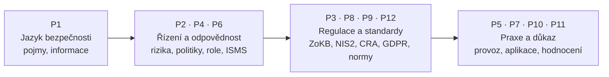
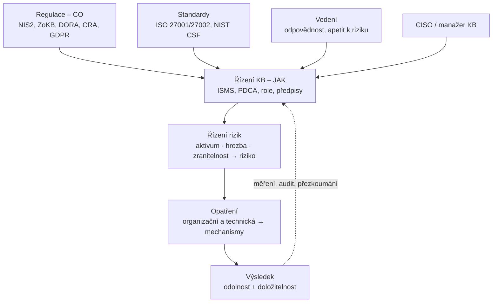

# PV017 – Řízení informační bezpečnosti (podzim 2026)

> [!abstract] O čem předmět je
> **Od techniky k řízení odpovědnosti.** Technická opatření (šifrování, síť, hardening, autentizace, monitoring, secure coding) jsou základ – PV017 řeší **prostředí, ve kterém mají dávat smysl, fungovat a být doložitelná**: od rizika přes provoz až k regulaci a důkazu.
> Bezpečnost se posunula od otázky „umíme to nastavit?" k otázce **„umíme to řídit, doložit a nést odpovědnost?"**

Garant: **Kamil Malinka** (materiály doc. Staudka, konzultace prof. Matyáše) · Slajdy: [[PV017_organizace_predmetu_2026.pdf]] a složka `SlidesXmaterial/`

## Organizace a hodnocení

| | |
|---|---|
| Přednášky | **12 × 2 h** (výklad, kontext, praktické perspektivy) |
| **Polosemestrální zkouška** | **30 b.** – **testové otázky**; **3. 11.** v rámci přednášky, 2–3 skupiny |
| **Závěrečná písemka** | **70 b.** – kombinace **otevřených a testových** otázek |
| Formální info a termíny | vše v **IS MU** |

> [!warning] Midterm 3. 11. – testové otázky
> Pokrývá zřejmě P1–P7. Rychlé opakování: [[#Checklist na midterm]] · [[PV017 - Glosář#Čísla a data, která se hodí na test|čísla a data na test]] · otázky na konci každé přednášky (rozbalovací callouty).

## Pět otázek předmětu (organizace, s. 2)

1. Co je pro organizaci **přijatelné riziko**? → [[Riziko]], [[Řízení rizik]]
2. **Kdo rozhodne** a kdo za rozhodnutí **odpovídá**? → [[Odpovědnost vedení]], [[Bezpečnostní role]]
3. Jaké **politiky a procesy** to vynucují? → [[Vnitřní předpisy]], [[ISMS]]
4. Co po nás chtějí **NIS2, ZoKB, CRA a GDPR**? → [[NIS2]], [[ZoKB]], [[CRA]], [[GDPR]]
5. Jak **prokážeme**, že bezpečnost opravdu funguje? → [[Compliance]], [[PDCA]]

**Proč právě teď:** **NIS2** (širší záběr, reporting incidentů, odpovědnost vedení) · **ZoKB** (česká implementace NIS2 účinná od **1. 11. 2025**) · **CRA** (bezpečnost produktů s digitálními prvky po celý životní cyklus). Dopadne to na architekty, vývojáře, provoz, bezpečnostní týmy i vedení.

## Mapa semestru

Pět tematických os: **riziko a rozhodování** · **politiky, role a odpovědnost** · **ISMS a provozní bezpečnost** · **hodnocení, audit a důkazy** · **regulace, standardy, dodavatelé**.

## Přednášky

| # | Datum | Přednášející | Téma | Poznámky |
|---|---|---|---|---|
| 1 | 15. 9.* | Malinka | Co je (informační) bezpečnost, základní pojmy, dosahování IB | [[1 260915 - Úvod do informační bezpečnosti\|P1]] |
| 2 | 22. 9.* | Malinka | ISMS, řízení rizik stručně, politiky, kdo má IB na starosti | [[2 260922 - ISMS a role v organizaci\|P2]] |
| 3 | 29. 9.* | Loutocký | Přístup k regulaci KB, legislativní rámec | [[3 260929 - Přístup k regulaci KB\|P3]] |
| 4 | 6. 10. | Stupka | Role řízení kybernetické bezpečnosti | [[4 261006 - Role řízení KB\|P4]] |
| 5 | 13. 10.* | Kumpošt | Provozní bezpečnost – pohled z praxe | – |
| 6 | 20. 10. | Malinka | ISMS – systém procesů pro kontinuální efektivitu zabezpečování | – |
| 7 | 27. 10. | Matyáš + Malinka | Jak hodnotit bezpečnost, role standardů (Common Criteria) | – |
| 8 | **3. 11.** | Malinka | **Polosemestrální písemka** | – |
| 9 | dle IS | Loutocký | Právní rámec KB (ZoKB, NIS2, CRA, GDPR) | – |
| 10 | dle IS | Stecko | Aplikační bezpečnost – pohled z praxe | – |
| 11 | dle IS | Sedláček | Posuzování kyberbezpečnosti – pohled z praxe | – |
| 12 | dle IS | Kasl | Certifikace, sdílení dat, dodavatelské řetězce, nové výzvy regulace | – |

\* Data označená hvězdičkou jsou dopočítaná (přednášky v úterý; 6. 10., 20. 10., 27. 10. a 3. 11. jsou potvrzené ze slajdů). Pozor: **17. 11. je státní svátek** – rozpis P9–P12 ověř v IS.

> [!tip] Šablona pro další přednášky
> Pojmenování: `N YYMMDD - Téma.md` (např. `5 261013 - Provozní bezpečnost.md`). Struktura: frontmatter → TL;DR → sekce s odkazy na slajdy `[[soubor.pdf#page=N|s. N]]` → otázky v `> [!question]-` → Souvislosti.

## Pojmy (atomické poznámky ve složce `Pojmy/`)

### Základní pojmy bezpečnosti (P1)
[[Safety vs Security]] · [[CIA triáda]] · [[Aktivum]] · [[Zranitelnost]] · [[CVE]] · [[Hrozba]] · [[STRIDE]] · [[Útok a bezpečnostní incident]] · [[Riziko]] · [[Model útočníka]] · [[Opatření]] · [[Bezpečnostní mechanismus]] · [[Obecný model zabezpečování]] · [[Principy návrhu bezpečnostních opatření]] · [[Klasifikace aktiv dle ZoKB]]

### Řízení bezpečnosti a ISMS (P1, P2, P4)
[[ISMS]] · [[PDCA]] · [[ISO-IEC 27001]] · [[ISO-IEC 27002]] · [[Rodina norem ISO 27k]] · [[Rámce řízení KB]] · [[Rozsah řízení (scope)]] · [[Řízení rizik]] · [[Prohlášení o aplikovatelnosti (SoA)]] · [[Plán zvládání rizik (RTP)]] · [[Dokumentace ISMS]] · [[Vnitřní předpisy]] · [[Compliance]] · [[Řízení dodavatelů]] · [[Hlášení incidentů]]

### Role a odpovědnost (P2, P4)
[[Governance, management a provoz]] · [[Odpovědnost vedení]] · [[CISO]] · [[Výbor pro řízení KB]] · [[Bezpečnostní role]] · [[Model tří linií]] · [[RACI]]

### Regulace a instituce (P3, P4)
[[Kybernetická bezpečnost (pojem)]] · [[Kyberbezpečnost, kyberobrana, kyberkriminalita]] · [[Lessigovy modality regulace]] · [[Selhání trhu v kyberbezpečnosti]] · [[Přístupy k zajištění KB]] · [[Technologická neutralita]] · [[Regulatorní mix]] · [[Rizikově orientovaný přístup]] · [[Vývoj regulace KB v EU]] · [[NIS2]] · [[ZoKB]] · [[CRA]] · [[DORA]] · [[GDPR]] · [[NÚKIB]] · [[Instituce KB v ČR]]

Všechny pojmy a zkratky v jedné tabulce: [[PV017 - Glosář]]

## Jak to celé drží pohromadě

## Checklist na midterm

Odškrtávej, co umíš vysvětlit vlastními slovy:

- [ ] Safety × security; CIA + 4 rozšiřující vlastnosti → [[CIA triáda]]
- [ ] Definice: aktivum, zranitelnost, hrozba, útok, incident, riziko, opatření, mechanismus
- [ ] Obecný model zabezpečování – kdo je kde a co s čím souvisí → [[Obecný model zabezpečování]]
- [ ] Riziko = P × D; podmínka efektivnosti opatření (cena ≤ škoda)
- [ ] STRIDE – písmena a porušené vlastnosti → [[STRIDE]]
- [ ] IBM třídy útočníků 0 / 1 / 1,5 / 2 / 3 → [[Model útočníka]]
- [ ] ISO 27002:2022 – 93 / 4 témata / 5 atributů; preventivní × detekční × nápravné
- [ ] 8 principů návrhu (Saltzer & Schroeder) + příklady → [[Principy návrhu bezpečnostních opatření]]
- [ ] Klasifikace aktiv dle ZoKB (nízká–kritická pro C, I, A)
- [ ] ISMS – definice, vlastnosti, certifikace; 27001 × 27002 → [[ISMS]]
- [ ] 27001 kapitoly 4–10 a mapování na PDCA → [[ISO-IEC 27001]]
- [ ] Scope ISMS – pravidla; 4 kroky dle P4 → [[Rozsah řízení (scope)]]
- [ ] Povinná dokumentace ISMS (SoA vs RTP!) → [[Dokumentace ISMS]]
- [ ] 5 fází projektu implementace (ISO 27003); trojimperativ
- [ ] CISO – kam ho zařadit a kam nikdy; řídicí výbor → [[CISO]]
- [ ] CySec × InfoSec × ICTSec; kyberbezpečnost × obrana × kriminalita
- [ ] Lessigovy modality; selhání trhu; deterrence × information × resilience
- [ ] Technologická neutralita, risk-based, regulatorní mix a pyramida, compliance meze/přínosy
- [ ] EU timeline (ENISA 2004 → NIS 2016 → CSA 2019 → NIS2/DORA/CRA 2022); 3 pilíře NIS
- [ ] ČR: NBÚ 2011 → NÚKIB 2017; ZoKB 181/2014 → 264/2025 (1. 11. 2025); vyhl. 409 vs 410
- [ ] Regulace CO × řízení JAK; governance / management / operations
- [ ] Odpovědnost vedení: NIS2 čl. 20, čl. 32/5, DORA čl. 5, OZ § 159, ZOK § 51
- [ ] Hlášení: 24 h / 72 h / 1 měsíc; GDPR 72 h ÚOOÚ
- [ ] Vnitřní předpisy: hierarchie, § 305 / § 301 ZP, závaznost vůči dodavatelům
- [ ] Model tří linií, role dle vyhl. 409/2025, RACI (jedno A)

## Zdroje

- [[PV017_organizace_predmetu_2026.pdf]]
- [[PV017_01_2026_uvod_do_bezpecnosti.pdf]] · [[PV017_02_2026_ISMS.pdf]] · [[PV017_03_2026_Pristup_k_regulaci_kyberneticke_bezpecnosti.pdf]] · [[PV017_04_2026_Role_rizeni_kyberneticke_bezpecnosti.pdf]]
- ISO/IEC 27001 zdarma: sponzorovaný přístup Agentury ČAS (`sponzorpristup.agentura-cas.cz`)
- NÚKIB – průvodce novým ZoKB, Národní strategie KB 2026–2030 (nukib.gov.cz)

> [!note] Legenda
> - Callout **„Kontext navíc"** = informace nad rámec slajdů (ověřené, ale na zkoušku primárně platí slajdy).
> - Odkazy typu `s. 20` otevřou PDF slajdů přímo na dané stránce.
