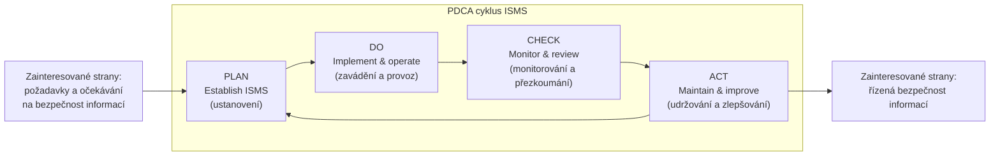
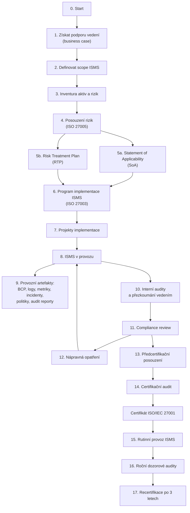
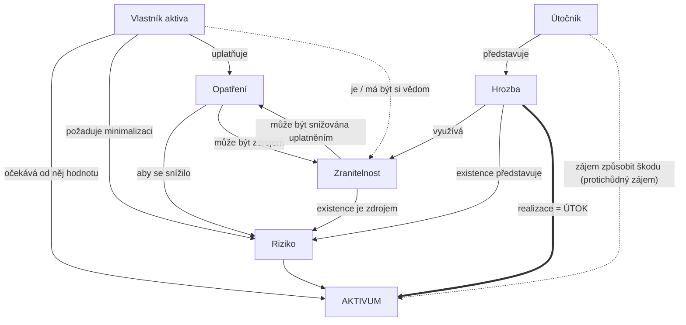

# P1 – Úvod do informační bezpečnosti

← [[0 PV017 - Přehled předmětu|Přehled předmětu]] · další → [[2 260922 - ISMS a role v organizaci|P2]]

Slajdy: [[PV017_01_2026_uvod_do_bezpecnosti.pdf]] (84 s.) · Přednášející: Kamil Malinka

> [!abstract] TL;DR
> - **Safety** (bezpečí) = ochrana proti *nahodilým* událostem; **security** (bezpečnost) = ochrana proti *úmyslným* škodám → [[Safety vs Security]].
> - Informace je bezpečná, když je zajištěna **[[CIA triáda|CIA]]** – důvěrnost, integrita, dostupnost (+ autenticita, accountability, nepopiratelnost, spolehlivost).
> - Základní řetězec pojmů: [[Aktivum]] → [[Zranitelnost]] → [[Hrozba]] → [[Útok a bezpečnostní incident|útok / incident]] → [[Riziko]] → [[Opatření]] → [[Bezpečnostní mechanismus|mechanismus]].
> - Perfektní bezpečnost neexistuje → chceme *přiměřenou* ochranu; bezpečnost je **proces**, ne jednorázová akce → řeší ji [[ISMS]] v cyklu [[PDCA]].
> - Opatření se volí **podle analýzy rizik**; podmínka efektivnosti: **cena opatření ≤ výše škody**. Katalog best practices = [[ISO-IEC 27002]].
> - Návrh opatření se řídí [[Principy návrhu bezpečnostních opatření|principy Saltzera & Schroedera]] (least privilege, fail-safe defaults, open design…).

---

## 1. Safety × Security × Bezpečnost

*Slajdy [[PV017_01_2026_uvod_do_bezpecnosti.pdf#page=3|3–5]]* · detail: [[Safety vs Security]]

| | Safety (bezpečí) | Security (bezpečnost) |
|---|---|---|
| Proti čemu | **nahodilým** událostem | **úmyslným** škodám |
| Co chrání | osoby, hmotná i nehmotná aktiva před ztrátami (fyzické, finanční, psychologické…) | aktiva před úmyslnými (trestnými) činy – vloupání, krádež, vandalismus… |
| Formulace | „za definovaných podmínek někdo či něco **nezpůsobí škodu**" | „aktivum je **ochráněno před útočníkem**" |

- **Information security** (informační bezpečnost) = ochrana proti úmyslným škodám a nežádoucím akcím na **informačních aktivech**.
- Čeština má jen jedno slovo „bezpečnost" → v textu je vždy potřeba poznat, kterou z rovin autor myslí.

## 2. Motivace – proč to celé řešit

*Slajdy [[PV017_01_2026_uvod_do_bezpecnosti.pdf#page=6|6–8]]*

- Žijeme v **informačním věku** – systémy zpracovávající informace jsou bází většiny každodenních transakcí. Informace se přenáší, zpracovává, uchovává; souvisí s ní procesy, systémy, lidé, sítě.
- Vše čelí rizikům: cílené útoky, chyby, přírodní katastrofy.
- Pro zajištění IB je třeba **systematicky** zavádět opatření a zároveň zohledňovat **měnící se rizika i účinnost opatření**, aby byly splněny definované bezpečnostní cíle.
- **IBM: Cost of a Data Breach Report (2026)** – čísla ze slajdu:
  - **4,99 mil. USD** – průměrná globální cena úniku dat (+12 % meziročně, rekord),
  - **+56 %** útoků řízených AI (deepfake impersonace, AI malware),
  - **6 mil. USD** – průměrná cena útoku typu *AI model inversion*,
  - **1,93 mil. USD** – úspora u organizací s rozsáhlým využitím AI a automatizace v bezpečnosti.
- Další tlak: **zákazníci** bezpečnost vyžadují, roste **legislativa** ([[GDPR]], [[NIS2]] – širší než původní ZoKB), firmy si uvědomují dopady ⇒ **nedostatek pracovníků v oboru**.
- IT bezpečnost je komplexní obor s mnoha profesemi (slajd 8 – NICCS/CISA *Cyber Career Pathways*).

## 3. Existuje perfektní bezpečnost?

*Slajdy [[PV017_01_2026_uvod_do_bezpecnosti.pdf#page=9|9–10]]*

**Ne.** Absolutní eliminace všech rizik není dosažitelná.

- Prolomení všech způsobů zabezpečení je jen otázkou **času a energie** – od (mili)sekund po miliardy násobků stáří sluneční soustavy.
- Na každý bezpečnostní algoritmus lze útočit **hrubou silou** (brute force).
- Jaké řešení tedy chceme?
  - Každý nástroj „dostatečně" zabezpečující aktivum musí být **akceptovatelný uživatelskou komunitou**.
  - Nástroje musí být použity **vyrovnaně** – systém je tak bezpečný, jak je bezpečný jeho **nejslabší článek** (weakest link).

> [!example] xkcd #538 „Security" (slajd 9)
> Kryptograf si představuje útok na 4096-bit RSA; reálný útočník vezme klíč francouzským klíčem za 5 $. → Nejslabší článek často není technologie, ale člověk.

## 4. Bezpečnost je proces → ISMS

*Slajdy [[PV017_01_2026_uvod_do_bezpecnosti.pdf#page=11|11–18]]* · detail: [[ISMS]], [[PDCA]], [[Rodina norem ISO 27k]]

**Proč proces, ne jednorázová záležitost?**
- vyvíjejí se technologie,
- vznikají nové / dokonalejší formy útoků,
- mění se regulační prostředí (legislativa),
- bezpečnostní politiku je nutné udržovat **aktuálně validní**.

Je nutné plánovat procesy vedoucí k **periodickému** vypracování a prosazování bezpečnostní politiky:
evidence aktiv → zjištění rizik → volba / vývoj / nákup opatření → vypracování BP → vyhodnocování účinnosti BP v provozu → … (a znovu).

Problém řeší manažerský systém – **Systém řízení informační bezpečnosti (ISMS, Information Security Management System)**:
- systematický přístup pro vybudování, implementaci, provozování, monitorování, přezkoumávání, udržování a vylepšování InfoSec v organizaci,
- skládá se z organizační struktury, definovaných odpovědností, politik, metod, procedur, plánovacích činností, zdrojů…

### PDCA cyklus ISMS (dle ISO/IEC 27001)

### Normy, na kterých je přednáška postavená (slajd 14–15)

- **ISO/IEC 27001** – ISMS – *požadavky* (requirements; certifikovatelná) → [[ISO-IEC 27001]]
- **ISO/IEC 27002** – soubor postupů pro *opatření* (code of practice) → [[ISO-IEC 27002]]
- **ISO/IEC 27003** – ISMS – *pokyny* k implementaci
- **ISO/IEC 27004** – monitorování, měření, analýza a hodnocení
- **ISO/IEC 27005** – řízení *rizik* bezpečnosti informací
- **ISO/IEC 27014** – *správa a řízení* (governance) bezpečnosti informací
- **ISO/IEC 15408** – Common Criteria (hodnocení bezpečnosti produktů)
- Struktura rodiny 27k (slajd 15): norma slovníku (27000) → normy požadavků (27001, 27006, 27009) → normy směrnic (27002–27005, 27007, 27013, 27014, 27021…) → oborové směrnice (27010, 27011, 27017, 27018, 27019) → viz [[Rodina norem ISO 27k]].

> [!tip] Norma 27001 zdarma (slajd 16)
> K ISO/IEC 27001 je **sponzorovaný přístup zdarma** přes Agenturu ČAS – stačí registrace na `sponzorpristup.agentura-cas.cz`.

> [!info] Kontext navíc – verze norem
> Na slajdech jsou letopočty českých převzetí (ČSN, např. „27001:2014" = české vydání verze 2013). Aktuální mezinárodní verze jsou **ISO/IEC 27001:2022** a **ISO/IEC 27002:2022** (s 93 opatřeními – viz níže).

### Klíčové komponenty ISMS (slajd 17)

| Společné pro jakýkoli systém řízení | Specifické pro ISMS |
|---|---|
| politika | **posuzování rizik** bezpečnosti informací |
| osoby s definovanými odpovědnostmi | **ošetření rizik** vč. určení a implementace opatření |
| procesy řízení (politiky, povědomí, plánování, implementace, provoz, posuzování, přezkoumání, zlepšování) | |
| dokumentované informace | |

### Proces implementace a certifikace ISMS (slajd 18, ISO27k Forum 2022)

## 5. Co je informační bezpečnost – CIA

*Slajdy [[PV017_01_2026_uvod_do_bezpecnosti.pdf#page=20|20–23]]* · detail: [[CIA triáda]]

Informace je bezpečná, když je zajištěna její:

| Vlastnost | EN | Význam |
|---|---|---|
| **Důvěrnost** | Confidentiality (C) | přístupná **pouze oprávněným** subjektům |
| **Integrita** | Integrity (I) | modifikovatelná **pouze oprávněnými** subjekty |
| **Dostupnost** | Availability (A) | **dostupná** oprávněným subjektům (do stanovené doby) |

Rozšiřující vlastnosti:
- **Autenticita** (authenticity) – pravost, původnost,
- **Zodpovědnost / prokazatelnost** (accountability) – akce lze sledovat až k entitě, která je provedla,
- **Nepopiratelnost** (non-repudiation) – schopnost prokázat výskyt události / činnosti,
- **Spolehlivost** (reliability) – bezporuchovost, činnost ve shodě se specifikací.

**Důvěrnost** – zpřístupnit „správným lidem", zabránit „špatným lidem"; týká se **uchovávání i přenosu**; únik → ztráta důvěry, právní akce; úzce souvisí s ochranou **osobních údajů**.

**Integrita (celistvost)** – důvěryhodnost informačních zdrojů:
- *integrita zdroje* – změny smí provádět jen autorizované subjekty a mechanismy,
- *integrita dat* – data nesmí být nevhodně, náhodně či záměrně změněna,
- *integrita původu* – data skutečně pochází od toho, kdo je validně poskytuje (ne od podvodníka),
- přistupujeme k **platným** (odrážejí skutečnost) a **spolehlivým** (za stejných okolností stejná data) informacím,
- aktiva musí být **kompletní a korektní**; modifikace může být úmyslná i neúmyslná; ignorování → chybná rozhodnutí, podvody.

**Dostupnost** – „nedostupný IS v okamžiku potřeby je přinejmenším stejně špatný jako žádný IS". Ohrožují ji technické problémy, přírodní jevy, lidské faktory (havárie i útoky). Ztráta dostupnosti kritického systému → dopad na byznys a výkonnost uživatelů.

## 6. Základní pojmy (přehled)

*Slajd [[PV017_01_2026_uvod_do_bezpecnosti.pdf#page=25|25]]*

| Pojem | EN | Definice (slajd) |
|---|---|---|
| [[Aktivum]] | asset | cokoli hodnotného, užitečného – věc, výhoda, zdroj |
| [[Zranitelnost]] | vulnerability | slabina využitelná ke způsobení škod/ztrát organizaci útokem |
| [[Hrozba]] | threat | potenciální příčina nežádoucího bezpečnostního incidentu |
| [[Riziko]] | risk | pravděpodobnost, že se v daném zranitelném místě uplatní hrozba |
| [[Útok a bezpečnostní incident\|Útok]] | attack | pokus o způsobení škody na aktivech (útočník využije zranitelnost) |
| [[Útok a bezpečnostní incident\|Bezpečnostní incident]] | security incident | událost, která může ohrozit bezpečnost informací |
| [[Opatření]] | control | prostředek, který **modifikuje riziko** |

## 7. Obecný model zabezpečování

*Slajdy [[PV017_01_2026_uvod_do_bezpecnosti.pdf#page=26|26–30]]* (postupně se skládající obrázek) · detail: [[Obecný model zabezpečování]]

Legenda vlevo na slajdu 30 – **tři vrstvy řízení**:
1. Účinná opatření determinují procesy **řízení rizik** → [[Řízení rizik]]
2. Validní uplatňování opatření předepisuje **bezpečnostní politika** → [[Vnitřní předpisy]]
3. Aktuálnost opatření a bezpečnostní politiky zajišťují procesy **ISMS** → [[ISMS]]

## 8. Generický problém budování bezpečných systémů

*Slajdy [[PV017_01_2026_uvod_do_bezpecnosti.pdf#page=31|31–33]]*

> [!important] Asymetrie obránce × útočník
> - **Systém** je úspěšný (bezpečný), když chrání proti **všem** možným útokům – včetně těch, které v době jeho tvorby ještě neexistovaly.
> - **Útočníkovi** stačí **jediná** nedokonalost v ochranách.
>   - může vyčkat, až mu technologický vývoj dá nástroj, se kterým tvůrci nepočítali,
>   - škála bezpečnostních nástrojů nebude nikdy úplná vůči budoucím hrozbám,
>   - reálné účinky nástrojů často nesplňují nebo postupně přestávají plnit původní cíl.

**Příklad – notebook na zadním sedadle auta** (slajd 32): pravidla (nenechávat bez dozoru, parkovat jen ve fyzicky chráněném prostoru, silné heslo, šifrování citlivých dat, odpovědnost v pracovní smlouvě) **nebudou účinná, pokud s nimi firma zaměstnance neseznámí**.

Z toho plyne (slajd 33):
- IB se nezajistí jedním opatřením – musí jich být **více současně**,
- opatření nejsou jen IT: organizace, HR, fyzická bezpečnost, legislativa, školení,
- data nejsou jen v noteboocích: servery, zásuvky, mobily, USB, **hlavy zaměstnanců**…
- je nutné vytvořit a udržovat **komplexní bezpečné prostředí** – takové prostředí už definují standardy: **ISO 27001, COBIT, NIST SP 800**.

### Cvičení: přihlášení do IS MU (slajdy 34–35)

| Otázka | Odpověď ze slajdu |
|---|---|
| Uživatel | studenti, akademici, úředníci, alumni, … třetí strany? |
| Aktiva | data, osobní údaje |
| Útočník | jiný student, generický hacker hledající zdroje |
| Škoda | únik osobních dat, uniklá hesla, změna známky → poškození pověsti |
| Zranitelnost | slabá hesla, špatná kontrola vstupů, OS, nešifrovaná data, absence TLS |
| Hrozba | DoS, phishing, cross-site scripting |
| Riziko | … (= pravděpodobnost × dopad pro konkrétní dvojice hrozba–zranitelnost) |

## 9. Aktiva (assets)

*Slajd [[PV017_01_2026_uvod_do_bezpecnosti.pdf#page=37|37]], [[PV017_01_2026_uvod_do_bezpecnosti.pdf#page=77|77]]* · detail: [[Aktivum]]

- Aktivum = předmět, myšlenka, informace… **mající pro organizaci hodnotu**; ekonomický zdroj, který lze vlastnit / ovládat s cílem produkovat pozitivní ekonomickou hodnotu.
- **Hmotná** (tangible): peníze, budovy, pozemky, vozidla, zařízení, služby, lidé…
- **Nehmotná** (intangible): software, data, patenty, autorská práva, licence, ochranná známka, jméno, **pověst**…
- Tři hlavní kategorie aktiv v IT: **data** · **systémy** s daty a komunikační infrastruktura · **lidské zdroje**.
- Dle ZoKB (dodatek, slajd 77): informace / služba zpracovávaná IS, zaměstnanci a dodavatelé podílející se na provozu, technické vybavení, komunikační prostředky, programové vybavení, objekty IS.

## 10. Zranitelnost (vulnerability)

*Slajdy [[PV017_01_2026_uvod_do_bezpecnosti.pdf#page=39|39–42]]* · detail: [[Zranitelnost]], [[CVE]]

- Slabina využitelná ke způsobení škod **útokem** – tj. **materializací hrozby** provedenou útočníkem.
- Příklad: hořlavý papír v serverovně = zranitelnost využitelná hrozbou požáru.
- Ne každá zranitelnost je známá → **zero-day vulnerability** (zranitelnost nultého dne).
- Kde se nachází: fyzické uspořádání, organizační schémata, administrativní opatření, personální politika, logická a technická opatření, HW, SW, data, návrh architektury, **i samotný ISMS**.
- **CVE (Common Vulnerabilities and Exposures)**: bezplatný slovník *známých* zranitelností, provozuje **MITRE**; ID ve tvaru `CVE-YYYY-NNNN…` (rok přidělení ID / zveřejnění + pořadové číslo); obsahuje popis a odkazy, **neobsahuje** informace o riziku, dopadu ani opravě (to dělají databáze zranitelností, např. NVD). Příklad na slajdu 42: `CVE-2023-28858` (redis-py, souvisí s březnovým výpadkem ChatGPT 2023).

## 11. Hrozba (threat)

*Slajdy [[PV017_01_2026_uvod_do_bezpecnosti.pdf#page=44|44–48]]* · detail: [[Hrozba]], [[STRIDE]]

- **Potenciální** možnost využití zranitelného místa k útoku; potenciální příčina incidentu s dopadem na C, I a/nebo A.
- „Co je hodnotné pro vlastníka aktiva, je pravděpodobně hodnotné i pro někoho jiného."

**Typy hrozeb** (slajd 45):
- **Odhalení** (disclosure) – např. analýza provozu (kdo s kým kdy komunikuje),
- **Podvod, klamání** (deception) – modifikace dat, falšování identity, popírání autorství/přijetí, hoaxy, **maškaráda** (masquerade), šíření malware (*planting*), příprava předmostí pro další útoky,
- **Narušení, ničení** (disruption) – modifikace dat/programů/chování HW, neoprávněné zásahy do komunikace.

**Podle zdroje** (slajd 46):
- **vnitřní** – útočník je uvnitř (nespokojený zaměstnanec smaže nezálohovaná data; neznalí zaměstnanci dělají chyby),
- **vnější** – útočník mimo síť (slovníkový útok na hraniční směrovač; hackeři, konkurence).

**STRIDE** (Microsoft) – framework pro modelování hrozeb (slajdy 47–48):

| Písmeno | Hrozba | Příklad ze slajdu |
|---|---|---|
| **S** | Spoofing | e-mail pod cizí identitou, falešná přihlašovací stránka |
| **T** | Tampering | přístup do DB přes default admin credentials, změna vlastních zdravotních údajů |
| **R** | Repudiation | nelze zjistit, kdo poslal příkaz ke smazání záloh |
| **I** | Information disclosure | únik dat ze špatně zpřístupněného cloudového úložiště |
| **D** | Denial of Service | rušení rádiových frekvencí IoT sítě |
| **E** | Elevation of Privilege | neoprávněné čtení paměti, kde mohou být hesla |

## 12. Útok, bezpečnostní incident

*Slajdy [[PV017_01_2026_uvod_do_bezpecnosti.pdf#page=50|50–51]]* · detail: [[Útok a bezpečnostní incident]]

- Útok = **realizovaná hrozba**: útočník využije zranitelnost informačního aktiva a způsobí škodu (snížení hodnoty, zničení, znepřístupnění, zveřejnění důvěrného).
- Generická kategorizace: **přírodní katastrofy** (zálohovat ve vzdálené lokalitě!) · **externí útoky** · **interní útoky** (např. Wikileaks z interně zcizených dat) · **selhání a neúmyslné lidské chyby** (výpadek napětí, káva v klávesnici, smazaná data).

> [!example] Ransomware v českých nemocnicích (slajd 51)
> - **Nemocnice Benešov**, 11. 12. 2019 – 3 týdny omezení provozu, škoda **59 mil. Kč**; nešlo o cílený útok. Dopady: omezení výkonů, neproplacené výkony pojišťovnami, ztráty transfuzní stanice, investice do zabezpečení, reinstalace, školení.
> - **FN u sv. Anny v Brně** (2020) – 4 týdny omezení provozu.
> - **PN Kosmonosy** (2020) – 10 dní omezení provozu.

## 13. Riziko a model útočníka

*Slajdy [[PV017_01_2026_uvod_do_bezpecnosti.pdf#page=53|53–55]]* · detail: [[Riziko]], [[Model útočníka]]

- **Velikost rizika = pravděpodobnost provedení útoku × výše škody** (dopad).
- Pravděpodobnost uplatnění hrozby je dána:
  - snadností/obtížností využití zranitelností aktiva,
  - množstvím a schopnostmi potenciálních útočníků.
- Užší smysl: pravděpodobnost, že se v daném zranitelném místě uplatní hrozba. Širší smysl: **pravděpodobnost incidentu × škoda / dopad**.
- Rizika mohou být různě závažná: katastrofická / velká, akceptovatelná, nevýznamná.

**Model útočníka – atributy protivníka** (slajd 54):
1. **Cíle** – napovídají, která aktiva chránit,
2. **Metody** – předpokládané techniky a typy útoků,
3. **Schopnosti** – výpočetní zdroje, dovednosti, znalosti, personál, příležitosti (fyzický přístup),
4. **Úroveň financování** – ovlivňuje odhodlání, metody i schopnosti,
5. **Outsider × insider** – insider má počáteční výhodu (znalosti, nižší oprávnění…).

**Klasifikace útočníků (IBM)** (slajd 55):

| Třída | Kdo | Charakteristika |
|---|---|---|
| 0 | script kiddies | bez znalosti systému, hotové nástroje, pokus/omyl |
| 1 | chytří nezasvěcení (clever outsiders) | inteligentní, málo znalostí systému, středně sofistikované vybavení |
| 1,5 | dobře vybavení lidé zvenku | dobré laboratorní vybavení, základní znalost systému (např. univerzitní laby) |
| 2 | zasvěcení insideři (knowledgeable insiders) | specializované vzdělání a zkušenosti, sofistikované nástroje |
| 3 | dobře financované organizace (funded organizations) | týmy specialistů, detailní analýzy, nejlepší nástroje, tvorba nových útoků |

## 14. Opatření (control)

*Slajdy [[PV017_01_2026_uvod_do_bezpecnosti.pdf#page=57|57–64]]* · detail: [[Opatření]], [[ISO-IEC 27002]]

- Opatření (control, measure, security enforcing function) = nástroj pro **snížení / eliminaci rizika**.
  - plné odstranění rizika bývá **neefektivní** → opatření riziko typicky **redukují**,
  - implementovat **jen pro konkrétní identifikovaná rizika**.
- Implementace pomocí mechanismů (software, hardware, administrativa); typické opatření = **technologie + procesy** (politika, vzdělávání).
  - *Příklad – antivir:* SW v bráně i na PC + procedura pravidelných aktualizací + výchova uživatelů k neotevírání příloh.
- Slajd 58 ukazuje obrovský výčet možných opatření (autentizace, šifrování, trezory, strážní, směrnice, školení, BCP, audit…) → **jak vybrat?**

**Zásady výběru** (slajd 59):
- **dle kontextu a analýzy rizik!**
- podmínka efektivnosti: **cena opatření ≤ výše škody**,
- s každým aktivem se druží více rizik; na identifikované riziko se musí vázat efektivní opatření; jedno opatření může řešit více rizik,
- návod k volbě best practices dává **ISO/IEC 27002**.

### ISO/IEC 27002:2022 (slajdy 60–64)

**93 opatření ve 4 tématech, 5 atributů:**

| Téma | Počet | Příklady |
|---|---|---|
| Organizační opatření | **37** | politiky pro IB, management identit, odezva na incidenty, kontinuita |
| Opatření v oblasti lidských zdrojů | **8** | prověřování, disciplinární řízení, práce na dálku, NDA |
| Opatření fyzické bezpečnosti | **14** | fyzický vstup, prázdný stůl a obrazovka, paměťová média, bezpečná likvidace |
| Technologická opatření | **34** | koncová zařízení, bezpečná autentizace, kryptografie, bezpečné programování |

**Atributy** (hashtagy u každého opatření):
1. **Typ opatření** – *preventivní* (zabránit), *detekční* (při výskytu), *nápravné* (po výskytu),
2. **Vlastnosti IB** – důvěrnost, integrita, dostupnost,
3. **Koncepty kybernetické bezpečnosti** – identifikace, ochrana, detekce, odezva, obnova (≈ funkce NIST CSF),
4. **Provozní schopnosti** – 15 kategorií (správa a řízení, bezpečnost aplikací, fyzická bezpečnost, dodavatelské vztahy, právní požadavky a soulad…),
5. **Domény bezpečnosti** – správa a řízení a ekosystém · ochrana · obrana · odolnost.

> [!example] Příklad ze standardu – 5.33 Ochrana záznamů (slajd 64)
> `#Preventivní` · `#Důvěrnost #Integrita #Dostupnost` · `#Identifikace #Ochrana` · `#Právní_požadavky_a_soulad #Management_aktiv #Ochrana_informací` · `#Obrana`

## 15. Bezpečnostní mechanismy

*Slajd [[PV017_01_2026_uvod_do_bezpecnosti.pdf#page=66|66]]* · detail: [[Bezpečnostní mechanismus]]

Opatření musíme **účinně implementovat** vhodnými mechanismy různé síly (administrativní, technické, logické…):

| Opatření řeší… | Mechanismus |
|---|---|
| nepopiratelnost | digitální podpis |
| řízení přístupu dle politiky | fyzické klíče, identifikační karty, biometrie |
| důvěrnost dle politiky | šifrování, trezory, smluvní závazek (NDA) |

> [!tip] Opatření × mechanismus
> **Opatření** = *co* děláme se rizikem (cíl, funkce). **Mechanismus** = *čím* to konkrétně realizujeme.

## 16. Klasifikace aktiv dle ZoKB

*Slajdy [[PV017_01_2026_uvod_do_bezpecnosti.pdf#page=67|67–69]], plné verze [[PV017_01_2026_uvod_do_bezpecnosti.pdf#page=82|82–84]]* · detail: [[Klasifikace aktiv dle ZoKB]]

Čtyřstupňové škály **nízká – střední – vysoká – kritická** zvlášť pro C, I, A. Klíčové body:

| Úroveň | Důvěrnost | Integrita | Dostupnost |
|---|---|---|---|
| **Nízká** | veřejná aktiva, žádná ochrana | ochrana není vyžadována | výpadek tolerován (~do 1 týdne), stačí pravidelné zálohování |
| **Střední** | neveřejné know-how, ochrana nevyžadována zákonem; **řízení přístupu** | standardní nástroje (omezení práv pro zápis) | výpadek max. **pracovní den**; běžné zálohování a obnova |
| **Vysoká** | ochrana vyžadována předpisy/smlouvou; **řízení a zaznamenávání přístupu, šifrovaný přenos** | **historie změn + identita** toho, kdo změnu provedl | výpadek max. **několik hodin**; záložní systémy |
| **Kritická** | nadstandardní ochrana (obchodní tajemství, citlivé osobní údaje); **evidence přístupů + ochrana i před administrátory** | **jednoznačná identifikace** autora změny (např. **digitální podpis**) | nepřípustný ani výpadek v řádu **minut**; záložní systémy, obnova **krátkodobá a automatizovaná** |

## 17. Principy návrhu a implementace bezpečnostních opatření

*Slajdy [[PV017_01_2026_uvod_do_bezpecnosti.pdf#page=71|71–75]]* · detail: [[Principy návrhu bezpečnostních opatření]]

Vycházejí z myšlenek **jednoduchosti a omezení**, zároveň vyžadují důkladnou a komplexní ochranu (každý externí systém je implicitně **nedůvěryhodný**).

| Princip | EN | Jádro | Příklad |
|---|---|---|---|
| Nejmenších práv | Least Privilege | jen minimální potřebná práva | middleware čte DB a zapisuje log, ale není root |
| Bezpečného výchozího stavu | Fail-safe Defaults | co není výslovně povoleno, je zakázáno | FW „deny all"; politika hesel zapnutá by default |
| Ekonomiky mechanismu | Economy of Mechanism | co nejjednodušší → méně chyb, snazší testování, menší attack surface | vyhledávání v helpu → riziko SQLi; nejlepší je funkci odstranit |
| Oddělení oprávnění | Separation of Privilege | oprávnění ne na základě jediné podmínky | root = heslo **a** členství ve skupině; admin OS nemůže nakupovat akcie |
| Psychologické přijatelnosti | Psychological Acceptability | mechanismus nesmí ztěžovat práci víc, než je nutné | uznání lidského faktoru |
| Otevřeného designu | Open Design | bezpečnost nezávisí na utajení návrhu | ✗ *security through obscurity* (klíč pod rohožkou); klíčové v kryptografii |
| Úplného zprostředkování | Complete Mediation | **každý** přístup se kontroluje | omezuje cachování oprávnění |
| Nejmenšího společného mechanismu | Least Common Mechanism | mechanismy přístupu nesdílet | sdílené kanály = cesta pro únik |

## 18. Dodatek – výčty dle ZoKB

*Slajdy [[PV017_01_2026_uvod_do_bezpecnosti.pdf#page=77|77–84]]*

**Příklady zranitelností** (slajdy 78–79): nedostatečná údržba IS · zastaralost IS · nedostatečná ochrana vnějšího perimetru · nedostatečné bezpečnostní povědomí uživatelů a adminů · nevhodné nastavení přístupových oprávnění · nedostatečné postupy při detekci bezpečnostních událostí/incidentů · nedostatečné monitorování uživatelů a adminů · nedostatečné stanovení pravidel a rolí · nedostatečná ochrana aktiv · nevhodná bezpečnostní architektura · nedostatečná míra nezávislé kontroly · neschopnost včas odhalit pochybení zaměstnanců.

**Příklady hrozeb** (slajdy 80–81): porušení bezpečnostní politiky / zneužití oprávnění · poškození či selhání HW/SW · zneužití identity · užívání SW v rozporu s licencí · škodlivý kód · narušení fyzické bezpečnosti · přerušení elektronických komunikací či elektřiny · zneužití nebo neoprávněná modifikace údajů · ztráta, odcizení, poškození aktiva · nedodržení smluvního závazku dodavatelem · pochybení zaměstnanců · zneužití vnitřních prostředků, sabotáž · dlouhodobé přerušení důležitých služeb · nedostatek kvalifikovaných zaměstnanců · cílený útok se sociálním inženýrstvím / špionáží · zneužití vyměnitelných nosičů · napadení elektronické komunikace (odposlech, modifikace).

> [!info] Kontext navíc
> Tyto výčty a škály klasifikace aktiv pocházejí z prováděcí vyhlášky k *původnímu* ZoKB (č. 181/2014 Sb., vyhláška č. 82/2018 Sb.). Od 1. 11. 2025 platí nový [[ZoKB]] č. 264/2025 Sb. s vyhláškami 409/2025 a 410/2025 Sb. – princip hodnocení aktiv podle C/I/A ale zůstává. Na slajdu 78 je mimochodem bod 1 a 5 shodný (překlep na slajdu).

---

## Otázky k procvičení

> [!question]- 1. Jaký je rozdíl mezi *safety* a *security*?
> Safety (bezpečí) = ochrana před **nahodilými** událostmi (za definovaných podmínek něco nezpůsobí škodu). Security (bezpečnost) = ochrana proti **úmyslným** škodám na aktivech. Informační bezpečnost = ochrana proti úmyslným škodám a nežádoucím akcím na informačních aktivech.

> [!question]- 2. Vyjmenuj a definuj vlastnosti CIA a čtyři rozšiřující vlastnosti.
> **C** důvěrnost – přístupné jen oprávněným; **I** integrita – modifikovatelné jen oprávněnými; **A** dostupnost – dostupné oprávněným (do stanovené doby). Rozšiřující: **autenticita** (pravost), **accountability** (akci lze dohledat k entitě), **nepopiratelnost** (lze prokázat výskyt události), **spolehlivost** (činnost dle specifikace).

> [!question]- 3. Je dosažitelná perfektní bezpečnost? Zdůvodni.
> Ne. Prolomení je otázkou času a energie, každý algoritmus lze atakovat hrubou silou, útočníkovi stačí jediná chyba a obránce musí počítat i s útoky, které ještě neexistují. Cílem je přiměřená ochrana akceptovatelná uživateli, aplikovaná vyrovnaně (nejslabší článek).

> [!question]- 4. Proč je zajištění informační bezpečnosti proces a ne jednorázová záležitost? Jaký systém to řeší?
> Mění se technologie, útoky, regulace i rizika, politiku je nutné udržovat validní a pravidelně vyhodnocovat účinnost opatření. Řeší to **ISMS** – manažerský systém fungující v cyklu **PDCA**.

> [!question]- 5. Definuj aktivum, zranitelnost, hrozbu, útok, incident, riziko a opatření.
> Aktivum – cokoli hodnotného · zranitelnost – slabina využitelná útokem · hrozba – potenciální příčina incidentu · útok – pokus o škodu využitím zranitelnosti (realizovaná hrozba) · incident – událost, která může ohrozit bezpečnost informací · riziko – pravděpodobnost × dopad (užší: pravděpodobnost uplatnění hrozby na zranitelném místě) · opatření – prostředek, který modifikuje riziko.

> [!question]- 6. (test) Zero-day zranitelnost je: a) zranitelnost opravená v den zveřejnění · b) zranitelnost dosud neznámá obráncům/výrobci · c) zranitelnost s CVSS 0 · d) chyba konfigurace
> **b)** – zranitelnost, která není známá (není pro ni oprava), a přesto ji lze zneužít.

> [!question]- 7. (test) Které tvrzení o CVE je pravdivé? a) obsahuje skóre rizika · b) provozuje ho NÚKIB · c) je to slovník známých zranitelností provozovaný MITRE · d) obsahuje postup opravy
> **c)** – CVE je slovník/identifikátor; riziko, dopad ani opravu neobsahuje (to doplňují databáze jako NVD).

> [!question]- 8. Rozepiš STRIDE a ke každé kategorii přiřaď porušenou bezpečnostní vlastnost.
> Spoofing → autenticita · Tampering → integrita · Repudiation → nepopiratelnost · Information disclosure → důvěrnost · Denial of Service → dostupnost · Elevation of Privilege → autorizace. *(Mapování na vlastnosti je kontext navíc, standardní u Microsoft STRIDE.)*

> [!question]- 9. Jaká je podmínka efektivnosti opatření a podle čeho se opatření vybírají?
> **Cena opatření ≤ výše škody.** Vybírají se podle kontextu a **analýzy rizik**, vždy navázané na konkrétní identifikované riziko; návod dává ISO/IEC 27002.

> [!question]- 10. (test) Kolik opatření a témat má ISO/IEC 27002:2022?
> **93 opatření ve 4 tématech**: organizační 37, lidské zdroje 8, fyzická 14, technologická 34; každé opatření má 5 atributů.

> [!question]- 11. Jaké typy opatření rozlišuje ISO 27002 podle vztahu k incidentu? Uveď příklad každého.
> **Preventivní** (zabránit – firewall, MFA), **detekční** (působí při výskytu – IDS, monitoring logů), **nápravné** (po výskytu – obnova ze záloh, incident response).

> [!question]- 12. Jaký je rozdíl mezi opatřením a bezpečnostním mechanismem?
> Opatření = funkce / prostředek modifikující riziko (např. „zajistit nepopiratelnost"). Mechanismus = konkrétní realizace (např. digitální podpis).

> [!question]- 13. Který princip porušuje „security through obscurity" a proč je to špatně?
> **Open Design** – bezpečnost nesmí záviset na utajení návrhu/implementace. Útočníci jsou chytří a mají čas; utajení dřív nebo později padne (klíč pod rohožkou).

> [!question]- 14. Firewall nastavený „vše zakázáno, explicitně povolujeme" je příklad kterého principu? A root vyžadující heslo i členství ve skupině?
> 1) **Fail-safe defaults**. 2) **Separation of privilege**.

> [!question]- 15. (test) Insider se specializovaným vzděláním a sofistikovanými nástroji patří dle IBM do třídy: a) 0 · b) 1 · c) 2 · d) 3
> **c) třída 2** – zasvěcení insideři. (3 = dobře financované organizace.)

> [!question]- 16. Jaké atributy útočníka zvažujeme v modelu útočníka?
> Cíle, metody, schopnosti (zdroje, znalosti, příležitosti), úroveň financování, outsider × insider.

> [!question]- 17. Popiš asymetrii mezi obráncem a útočníkem.
> Obránce musí chránit proti všem útokům včetně budoucích; útočníkovi stačí jediná slabina, může čekat na nové nástroje a sada obranných nástrojů nikdy nebude úplná.

> [!question]- 18. Jaké požadavky na ochranu dostupnosti klade klasifikace „kritická" dle ZoKB?
> Nepřípustný je i výpadek v řádu minut; záložní systémy a obnova služeb musí být krátkodobá a **automatizovaná**.

## Souvislosti

- Navazuje: [[2 260922 - ISMS a role v organizaci|P2 – ISMS a role]] (ISMS, PDCA, CISO), [[4 261006 - Role řízení KB|P4 – Role řízení KB]] (řízení rizik, role)
- Pojmy: [[CIA triáda]] · [[Aktivum]] · [[Zranitelnost]] · [[Hrozba]] · [[Riziko]] · [[Opatření]] · [[Principy návrhu bezpečnostních opatření]]
- [[PV017 - Glosář|Glosář]]
