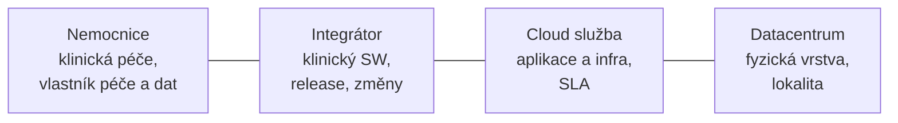
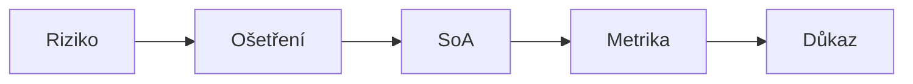
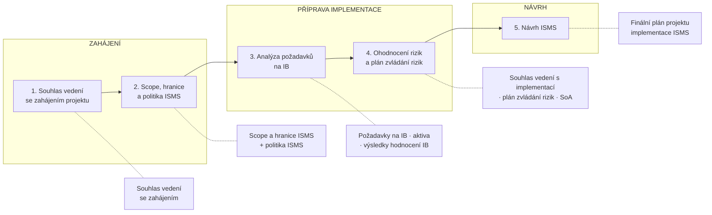
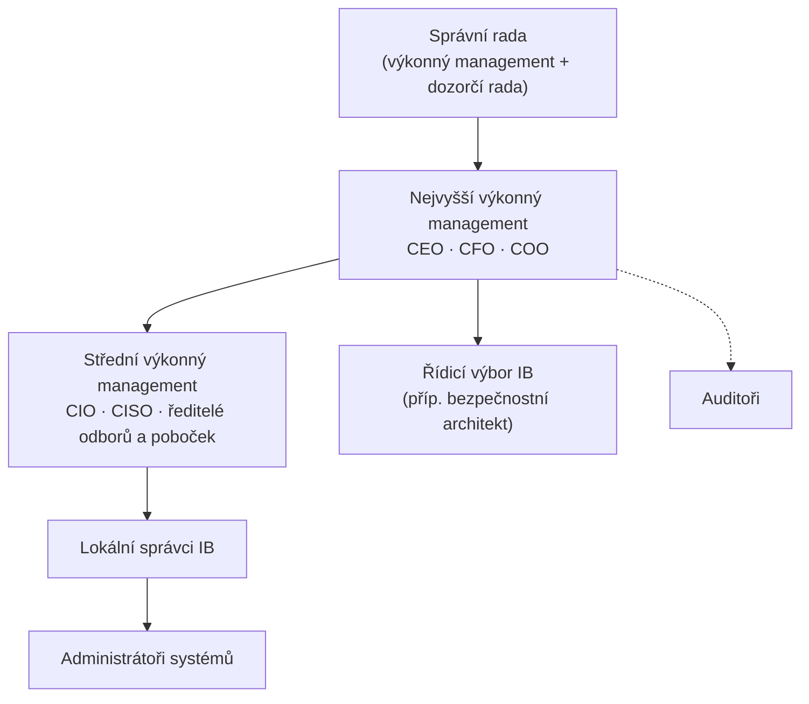

# P2 – ISMS, projekt implementace a role v organizaci

← [[1 260915 - Úvod do informační bezpečnosti|P1]] · [[0 PV017 - Přehled předmětu|Přehled]] · → [[3 260929 - Přístup k regulaci KB|P3]]

Slajdy: [[PV017_02_2026_ISMS.pdf]] (70 s.) · Přednášející: Kamil Malinka

Tři bloky přednášky: **(1)** ISMS jako systém řízení · **(2)** projekt implementace ISMS · **(3)** management, role a odpovědnosti. Uprostřed je případová studie **MediCloud**.

> [!abstract] TL;DR
> - [[ISMS]] = **dokumentovaný, trvale přezkoumávaný a vylepšovaný, důvěryhodný** systém řízení IB; je součástí celkového řízení organizace.
> - [[ISO-IEC 27001]] říká **jak** postavit ISMS a co má dělat (certifikovatelné); [[ISO-IEC 27002]] říká, **která opatření** použít (ale ne jak je prosazovat).
> - 27001 má **7 kapitol požadavků (4–10)**: kontext · vůdčí role · plánování · podpora · provoz · hodnocení výkonnosti · zlepšování → mapují se na [[PDCA]].
> - ISMS platí jen v definované **oblasti působnosti** ([[Rozsah řízení (scope)|scope]]) a stojí na **reálné podpoře vrcholového vedení**.
> - Klíčové dokumenty: politika IB, metodika rizik, **[[Prohlášení o aplikovatelnosti (SoA)|SoA]]**, **[[Plán zvládání rizik (RTP)|plán zvládání rizik]]**, registr aktiv… → [[Dokumentace ISMS]].
> - Implementace = projekt dle **ISO/IEC 27003** v 5 fázích; úspěch = věcně · časově · nákladově.
> - Role: CEO (celková odpovědnost), **[[CISO]]** (zajištění IB, nikdy ne z interního auditu), šéf projektu ISMS, **[[Výbor pro řízení KB|řídicí výbor IB]]**.

---

## Část 1 – ISMS: Systém řízení informační bezpečnosti

### 1.1 Co je ISMS

*Slajdy [[PV017_02_2026_ISMS.pdf#page=4|4–5]], [[PV017_02_2026_ISMS.pdf#page=9|9]]* · detail: [[ISMS]]

- ISMS je **součástí celkového systému řízení organizace**: struktura, politiky, plánovací činnosti, odpovědnosti, praktiky, procesy, zdroje.
- Je projevem toho, **jak organizace přistupuje k rizikům** daným orientací na informační ekonomiku.
- **Cíl** řízení pomocí procesů ISMS: správně fungující procesy podporující IB (autentizace, řízení přístupu, zálohování, podpisování…) – jejich návrh, implementace, zavedení, provoz, monitorování, přezkoumávání, udržování a **zajištění stanovené úrovně zaručitelnosti kvality** (assurance).
- Z definice standardem je ISMS systém řízení, který je:
  - **dokumentovaný**, systematicky implementovaný a řízený,
  - **trvale přezkoumávaný**, auditovaný a kontrolovaný,
  - **trvale vylepšovaný** (aktualizovaný),
  - **DŮVĚRYHODNÝ**.
- **Důkazem důvěryhodnosti je certifikace** – provádí ji třetí nezávislá certifikační autorita; dává důkaz úplnosti a kvality; pro byznys ceněná, ale **ne vždy nezbytná**; je vždy **finální etapou** vývoje a zavedení ISMS.

### 1.2 ISO 27001 × ISO 27002

*Slajdy [[PV017_02_2026_ISMS.pdf#page=6|6–8]]* · detail: [[ISO-IEC 27001]], [[ISO-IEC 27002]]

| | ISO/IEC 27001 | ISO/IEC 27002 |
|---|---|---|
| Typ | **specifikace / požadavky** (requirements) | **kodex nejlepších praktik** (code of practice) |
| Říká | **jak** navrhnout ISMS a **co** má ISMS dělat | **která** bezpečnostní opatření může/má systém obsahovat |
| Neříká | která konkrétní opatření podporovat | **jak** vybraná opatření prosazovat (k tomu navádí 27001) |
| Certifikace | **ano** – tisíce certifikovaných ISMS | ne (je to návod) |

**Co 27001 specifikuje** (slajd 7): procesy ustanovení a řízení ISMS · zavádění a provozování · monitorování a přezkoumávání účinnosti · udržování a zdokonalování · správy dokumentace · **odpovědnost vedení** za projekt ISMS · přezkoumávání audity **nezávislou třetí stranou** · aktualizace · cíle a principy opatření (ilustrativní výčet v **Příloze A**, analogie 27002).

**Proč používat 27001?** (slajd 8)
- specifikace známých **nejlepších** (mezinárodních, všeobecně akceptovaných) řídicích praktik + návod k jejich použití,
- **netechnická a nejurisdikční** forma, nevázaná na konkrétní technologie,
- **systematický**, pokrývá IB plně,
- validita prokázaná v mnoha nasazeních,
- produkt lze **externě certifikovat**,
- úzce navazuje na **ISO 9001** (kvalita procesů).

### 1.3 ISO 27001 – 7 kapitol požadavků

*Slajd [[PV017_02_2026_ISMS.pdf#page=11|11]]*

| Kap. | Název | Obsah | PDCA |
|---|---|---|---|
| 4 | **Kontext organizace** | záměr a potřeby organizace, rozsah ISMS, implementace a průběžné zlepšování | Plan |
| 5 | **Vůdčí role** (leadership) | závazek vedení, stanovení politiky, role a odpovědnosti | Plan |
| 6 | **Plánování** | opatření zaměřená na rizika (posouzení + ošetření) vč. seznamu opatření, cíle bezpečnosti a plán jejich dosažení | Plan |
| 7 | **Podpora** | zdroje, kompetence, povědomí, dokumentované a aktualizované informace | Do |
| 8 | **Provozování** | plánování a řízení provozu, průběžné posuzování a ošetření rizik | Do |
| 9 | **Hodnocení výkonnosti** | monitoring, audit, přezkoumání vedením | Check |
| 10 | **Zlepšování** | neshody a nápravná opatření, neustálé zlepšování | Act |

*(Mapování na PDCA – viz [[4 261006 - Role řízení KB|P4]], slajd 15.)*

### 1.4 Oblast působnosti, kontext, podpora vedení

*Slajdy [[PV017_02_2026_ISMS.pdf#page=12|12–14]]* · detail: [[Rozsah řízení (scope)]]

**Oblast působnosti (scope)** – požadavek přímo daný standardem:
- nemusí být celá organizace (obvykle ji vymezuje politika IB),
- informace do oblasti vstupuje a opouští ji **kontrolovaně** přes určené nástroje,
- v oblasti se musí nacházet **úplná chráněná informace** vč. všech souvisejících technických i netechnických procesů,
- hranice fyzicky nebo logicky definovatelné (data, sítě, lokace…), oblast musí být **vyčlenitelná od třetích stran** a jiných organizací ve skupině.

**Kontext** (slajd 13):
- *externí*: právní důsledky (přenosy dat US ↔ EU), geolokace (hurikány, záplavy, demonstrace), kulturní a sociální požadavky,
- *interní*: centralizace služeb – na MUNI např. **eduroam** (CESNET → ÚVT → fakulty, FI jako výjimka); co mimobrněnské lokality (Telč)?

**Podpora vedení** (slajd 14):
- úspěch ISMS **absolutně závisí na reálné a nepředstírané podpoře vrcholového managementu**,
- vedení se musí **průkazně zavázat** zajistit ekonomické a personální zdroje (požadavek 27001, **povinný důkaz pro certifikaci**) a stanovit prioritu projektu ISMS vůči ostatním,
- projekt ISMS je **projektem změny řízení** – nelze ho jen „transplantovat" do existujících procesů, vyvolá řadu změnových řízení.

### 1.5 Dokumentace ISMS

*Slajdy [[PV017_02_2026_ISMS.pdf#page=15|15–23]]* · detail: [[Dokumentace ISMS]]

Charakter ISMS je vidět už na výčtu dokumentace:

**Požadovaná dokumentace (15 položek):**

| # | Dokument | Pozn. |
|---|---|---|
| 1 | Oblast působnosti ISMS | krátký dokument hned na začátku |
| 2 | Politika IB, bezpečnostní cíle | co proti čemu/komu chráníme |
| 3 | **Metodologie ohodnocování a zvládání rizik** | 4–5 stran, **před** ohodnocením rizik; škály, úroveň akceptovatelnosti, jak řešit neakceptovatelná rizika (opatření, pojištění, zrušení aktivity, zvýšení akceptovatelnosti) |
| 4 | **Prohlášení o aplikovatelnosti (SoA)** | **která opatření a proč** |
| 5 | **Plán zvládání rizik (RTP)** | **kdo, které opatření, za kolik, kdy**; schvaluje vedení okamžitě („dává peníze") |
| 6 | Zpráva o posouzení a ošetření rizik | výsledek ohodnocení rizik |
| 7 | Definice rolí a odpovědností | přes všechny politiky; **co nejpřesněji** („CISO každé pondělí v XX:YY udělá XYZ"); třetí strany ve smlouvách |
| 8 | Soupis aktiv | |
| 9 | Akceptovatelné používání aktiv (AUP) | nejlépe formou politiky |
| 10 | Politika řízení přístupu | byznys i technická úroveň, logický i fyzický; **až po** ohodnocení rizik |
| 11 | Bezpečné provozní procedury IT | změny, třetí strany, zálohy, síť, malware, likvidace, přenosy, monitoring; **až po** ohodnocení rizik |
| 12 | Principy bezpečného systémového inženýrství | bezpečnost na všech úrovních (testování, akceptace, provoz, autentizace, session) |
| 13 | Bezpečnostní politika pro dodavatele | lustrace, hodnocení rizik dodavatele, opatření ve smlouvě, dozor, ukončení přístupů |
| 14 | Procedura reakce na incidenty | záznam, klasifikace, zvládání událostí a incidentů |
| 15 | Legislativní, regulační a smluvní požadavky | **dělat co nejdříve** – ovlivňuje zbytek |

**Požadované protokoly / záznamy** (slajdy 20–21): plnění programu školení (HR) · výsledky měření a monitorování (každé opatření by mělo mít **KPI**) · program interních auditů (roční plán, auditor, metoda, kritéria) · výsledky interních auditů · výsledky oponentur (zápisy z jednání managementu) · výsledky opravných akcí · **logy** uživatelských aktivit, výjimek a bezpečnostních událostí.

**Doporučovaná dokumentace** (slajdy 22–23): procedura správy dokumentů · nástroje pro správu protokolů · procedura interního auditu · procedura opravné akce · politiky **BYOD**, práce na dálku a z mobilních zařízení, **klasifikace informací**, **hesel**, likvidace, **čistého stolu/obrazovky**, změnového řízení, zálohování, přenosu informací · analýza dopadů (BIA) · plán procvičování a testování · plán údržby · plán oponentur · **strategie kontinuity činnosti**.

---

## Případová studie MediCloud

*Slajdy [[PV017_02_2026_ISMS.pdf#page=24|24–32]]* – ISMS pro nemocniční klinický systém v cloudu, prochází kapitoly 4–10 ISO 27001.

**Kap. 4 – Kontext a rozsah** (slajd 26): Než hodnotíme rizika, musíme vědět, **kdo za co odpovídá a co je ve scope**.
- potřeby: bezpečná péče, průkazná dokumentace, kontinuita, důvěra pacientů,
- požadavky: zdravotnická dokumentace, GDPR, smlouvy, SLA, audit, interní pravidla,
- scope ISMS: klinická aplikace, identity, monitoring, incidenty, změny, vendor management,
- řízené závislosti: cloud, DC, konektivita, subdodavatelé, externí vývoj.
- **Pointa: cloud a DC jsou mimo organizaci, ale uvnitř řízených závislostí ISMS.**

**Kap. 4 → 6 – Aktiva, toky, dopady** (slajd 27): „Aktivem není jen server. **Aktivem je schopnost bezpečně poskytovat péči.**"
- aktiva: klinický IS (EHR), databáze zdravotní dokumentace, záložní lokalita, laboratoř/PACS, identity a role, ekonomický IS,
- dopady: *důvěrnost* (únik citlivých dat, újma, reputace, DPIA, GDPR) · *dostupnost* (nedostupná dokumentace, „slepá operace", zpoždění péče) · *integrita* (špatná medikace, chybný výkon, důkazní problém).

**Kap. 6 – Identifikace a hodnocení rizik** (slajd 28): „Registr rizik umožňuje **prioritizovat**, ne jen vyjmenovat obavy." Riziko **R = P × D** (škála 1–4).

| Riziko | P | D | R | Rozhodnutí |
|---|---|---|---|---|
| R1 síť nedostupná | 3 | 4 | **12** | řešit |
| R2 únik dat | 2 | 4 | 8 | řešit |
| R3 integrita | 2 | 4 | 8 | řešit |
| R4 špatný provider | 2 | 4 | 8 | řešit |
| R5 selhání obnovy | 2 | 4 | 8 | řešit |
| R6 ekonomický IS | 3 | 2 | 6 | posoudit |

**Rozhodovací hranice: 1–3 akceptovat · 4–7 posoudit · 8–16 řešit.**

Matice (řádky dopad D, sloupce pravděpodobnost P):

| D \ P | 1 | 2 | 3 | 4 |
|---|---|---|---|---|
| **4** | 4 | 8 – R2, R3, R4, R5 | 12 – **R1** | 16 |
| **3** | 3 | 6 | 9 | 12 |
| **2** | 2 | 4 | 6 – R6 | 8 |
| **1** | 1 | 2 | 3 | 4 |

> [!todo] Cvičení ze slajdu
> U R1 urči aktivum, hrozbu, zranitelnost, incident, dopad a vlastníka rizika.
> *Možné řešení:* aktivum = dostupnost klinického IS / síťové spojení do cloudu · hrozba = výpadek konektivity, DDoS, chyba operátora · zranitelnost = jediná trasa / single point of failure · incident = nedostupnost klinického IS · dopad = zastavení péče, „slepé operace" · vlastník rizika = klinický vlastník služby (rozhoduje vedení).

**Kap. 6 – Ošetření rizik a SoA** (slajd 29): „Opatření musí být mapovaná na **riziko, implementaci, metriku a důkaz**."

| Riziko | Ošetření |
|---|---|
| R1 síť nedostupná | nonstop služba, backup trasy, backup HW, rezervované optiky, closed network, tunneling, monitoring |
| R2 únik dat | MFA, least privilege, šifrování, logging, **DPIA**, smluvní bezpečnostní příloha |
| R4 provider risk | **due diligence**, SLA, audit rights, subdodavatelé, **exit plán**, reporting |
| R5 data down | asynchronní replikace, backup site, **RTO/RPO**, test obnovy |

*Příklad SoA:* „Network security **ano**, protože R1. Supplier security **ano**, protože R4. Physical perimeter **omezeně**, protože je řízen u DC providera."

**Kap. 5 – Vůdčí role a akceptace zbytkového rizika** (slajd 30): „**Akceptace není nečinnost. Je to formální rozhodnutí oprávněné role.**"
- zbytková rizika: R1-A (síť spoléhá i na vyšší ochranné vrstvy proti silnému vnitřnímu útočníkovi), R1-B (při selhání hlavního uzlu běží jen subset nejkritičtějších služeb),
- role: **Vedení** (risk appetite, zdroje, rozhodnutí) · **CISO** (metoda ISMS, konzistence, reporting) · **Klinický vlastník** (dopad na péči, vlastník rizika) · **CIO/provoz** (technická realizace, změny) · **DPO/právník** (GDPR, DPIA, smlouvy) · **Supplier manager** (SLA, audit, exit, eskalace),
- **akceptační záznam:** vlastník, odůvodnění, zbytkové skóre, podmínky, platnost, datum přezkumu.

**Kap. 7 + 8 – Podpora a provoz** (slajd 31): opatření fungují jen s **lidmi, zdroji, dokumentací a provozním rytmem**.
- zdroje (rozpočet, 24/7, testy obnovy), kompetence (síťaři, klinická podpora, DPO, incident tým), povědomí (lékaři a sestry znají nouzový režim a eskalaci), dokumentace (runbooky, SLA, záznamy),
- provozní cyklus: provozní plán → řízení změn → incidenty → DR testy → supplier review → risk update,
- **pravidlo:** každá změna klinického toku má bezpečnostní posouzení, **rollback** a aktualizaci důkazů.

**Kap. 9 + 10 – Hodnocení a zlepšování** (slajd 32): ISMS musí **prokazovat funkčnost** a uzavírat smyčku přes nápravná opatření.
- monitoring (dostupnost, failover, MFA coverage, replikace, SLA) · **interní audit** (shoda politika ↔ proces ↔ konfigurace ↔ záznam ↔ realita) · **management review** (trendy rizik, cíle, zdroje, rozhodnutí vedení),
- *auditní otázka:* „Tvrdíte, že kritický subset běží do 30 minut. **Ukažte poslední test**, výsledek, odchylky a nápravná opatření."

> [!todo] Závěrečné cvičení
> Nemocnice přidá **AI triáž** nad klinickými daty. Kam se změna propíše?
> *Nápověda:* kontext a scope (nové aktivum, dodavatel AI) → nová rizika (integrita doporučení, únik dat, bias) → DPIA → SoA a RTP → školení personálu → monitoring a audit → management review.

---

## Část 2 – Projekt implementace ISMS

### 2.1 Dobrý začátek – půl je hotovo

*Slajdy [[PV017_02_2026_ISMS.pdf#page=34|34–35]]*

- Zredukujte zadání na to, o čem je **každý přesvědčen, že je realizovatelné** v čase a se zdroji.
- Dostatečné ekonomické a personální zdroje; **časová rezerva** pro případ, že se věci nevyvíjejí dobře.
- Každý zaměstnanec musí znát rizika vyžadující ISMS a **akceptovat opatření**.
- Lidé nemají rádi změny → počítejte s tím, že **alespoň hrstka lidí bude projekt podkopávat**.
- Návod: **ISO/IEC 27003** – jak zahájit, naplánovat a definovat projekt ISMS.
- **Projekt** = jedinečná soustava činností směřujících k jasně definovanému cíli, s **určeným začátkem a koncem**, vyžadující spolupráci profesí a spotřebovávající informace, materiál, peníze, schopnosti lidí.

### 2.2 Fáze projektu implementace ISMS (ISO/IEC 27003)

*Slajdy [[PV017_02_2026_ISMS.pdf#page=36|36–39]]*

**Dílčí kroky:**
1. **Získání souhlasu vedení** – priority organizace, předběžný scope, zakázka a plán projektu ke schválení.
2. **Definování oblasti a politiky ISMS** – hranice IB v organizaci → hranice ICT → fyzické hranice → integrace do scope ISMS → politika ISMS + souhlas vedení.
3. **Analýza požadavků na IB** – požadavky organizace, identifikace aktiv ve scope, ohodnocení IB.
4. **Ohodnocení rizik a plán zvládnutí** – ohodnocení rizik, výběr cílů opatření a opatření (**SoA**), souhlas vedení s implementací a provozem, **plán zvládání rizik**.
5. **Návrh ISMS** – návrh IB v organizaci, návrh fyzické a ICT bezpečnosti, návrh IB specifické pro ISMS, **finální plán projektu**.

### 2.3 Plán projektu a trojimperativ

*Slajdy [[PV017_02_2026_ISMS.pdf#page=40|40–41]]*

- Projekt je jedinečný → vždy je spojen s **rizikem neúspěchu** → potřebujeme scénář = **plán projektu**.
- Plánované úkoly: způsob řízení (waterfall × agile), integrace s jinými systémy řízení, klíčové odpovědnosti, zdroje v průběhu životního cyklu, využití konzultantů…
- **Úspěch projektu ve třech dimenzích** (trojimperativ):
  - **věcně** – CO, JAK, v JAKÉ KVALITĚ,
  - **časově** – KDY (etapy, kroky),
  - **nákladově** – ZA KOLIK (práce, pak peníze).
- Odpovídá náležitostem **smlouvy o dílo**: specifikace plnění + termíny + cena.

### 2.4 Metody řízení projektu – PDCA

*Slajdy [[PV017_02_2026_ISMS.pdf#page=42|42–47]]* · detail: [[PDCA]]

- 27001 **původně direktivně předepisoval** procesní přístup PDCA (Plan-Do-Check-Act, **Demingův cyklus**) – metoda postupného zlepšování opakováním 4 činností.
- Další aplikovatelné metody: **COBIT**, **ITIL**.

| Fáze | Název u ISMS | Hlavní činnosti |
|---|---|---|
| **PLAN** | zřízení / návrh ISMS | definice scope a politiky IB · systematický přístup k hodnocení rizik · procedury a provedení hodnocení rizik · možnosti zvládání rizik · výběr cílů a opatření · **SoA** |
| **DO** | implementace ISMS | **plán zvládání rizik** a jeho dokumentace (detailní BP, procesy, procedury) · implementace opatření · detekce incidentů a reakce · **školení** a program bezpečnostního uvědomění · zdroje pro ISMS |
| **CHECK** | sledování a posuzování | monitorování, testování, **audit** · shromažďování důkazů · měření výkonu procesů proti politice a cílům · zprávy pro management · měření účinnosti opatření |
| **ACT** | údržba a vylepšení | opravy a změny na základě **přezkoumání vedením** · identifikace, dokumentace a implementace vylepšení |

**Cestovní mapa PDCA cyklu ISMS** (slajd 47):

```mermaid
flowchart LR
    subgraph PLAN
        a1["Uvědomění si potřeby ISMS"] --> a2["Vymezení oblasti"] --> a3["Deklarace politiky<br/>(Board Policy)"] --> a4["Seznam aktiv"] --> a5["Hodnocení rizik"] --> a6["SoA"] --> a7["Odsouhlasení vedením<br/>(Board Approval)"]
    end
    subgraph DO
        b1["Plán zvládání rizik"] --> b2["Příprava dokumentace"] --> b3["Implementace ISMS,<br/>vč. testování"] --> b4["Školení, výchova"]
    end
    subgraph CHECK
        c1["Reakce na incidenty"] --> c2["Monitorování, přezkoumání,<br/>měření účinnosti, audit"]
    end
    subgraph ACT
        d1["Identifikace a implementace<br/>zdokonalení"]
    end
    a7 --> b1
    b4 --> c1
    c2 --> d1
    d1 -.->|"další iterace"| a5
```

---

## Část 3 – Management, role a odpovědnosti

### 3.1 Management organizace z pohledu IB

*Slajd [[PV017_02_2026_ISMS.pdf#page=49|49]]*

- **CEO** – výkonný (generální) ředitel · **CFO** – finanční ředitel · **COO** – provozní ředitel
- **CIO** – ředitel IT · **CISO** – manažer informační bezpečnosti

### 3.2 Zásady řízení IB v organizaci

*Slajdy [[PV017_02_2026_ISMS.pdf#page=50|50–51]]*

1. **IB se zavádí v celé organizaci** – integrovaná do procesů; fyzická a logická bezpečnost koordinovány; odpovědnost promítnuta do všech činností.
2. **Vychází z výstupů řízení rizik** – jak silné a nákladné zabezpečení dává smysl; založeno na **ochotě riskovat** (akceptovatelné ztráty).
3. **Investiční strategie IB je dána byznys cíli** – harmonizace byznysu a bezpečnosti.
4. **Shoda s interními a externími požadavky** – zákony, předpisy, smlouvy.
5. **Hodnocení výkonnosti IB musí sledovat byznys cíle** – nejen účinnost opatření, ale i vazbu na výkonnost podniku.
6. **Pozitivní prostředí pro IB** – lidské chování je základní prvek → vzdělávání, příprava, zvyšování povědomí.

### 3.3 Řídicí výbor informační bezpečnosti

*Slajdy [[PV017_02_2026_ISMS.pdf#page=52|52–54]]* · detail: [[Výbor pro řízení KB]]

- Ustanovený **nejvyšším managementem**; fórum členů **napříč funkční strukturou** (adekvátně odměňovaných).
- Člen pověřený celkovou architekturou IB = **bezpečnostní architekt**.
- Ve velkých organizacích může být více CISO (v každé části jeden), **řídicí výbor má však být unikátní**.
- Zasedá **2–4× ročně**, řádné zápisy; závěry projednává výkonný management.
- Aktivity (výběr): stanovení cílů IB · posuzování významu incidentů · pěstování povědomí · odsouhlasení rolí a odpovědností · odsouhlasení metodologií · kontrola zdrojů · kontrola integrace ISMS do procesů · **schvalování BP a scope ISMS** · **stanovení hladiny akceptovatelnosti rizika** · kontrola účinnosti opatření podle zpráv CISO · metriky vyhovění BP · zajištění **přezkoumání ISMS managementem alespoň 1× ročně** (vstupy získává a výstupy sděluje CISO).

### 3.4 CISO – manažer informační bezpečnosti

*Slajdy [[PV017_02_2026_ISMS.pdf#page=55|55–57]], dodatek [[PV017_02_2026_ISMS.pdf#page=62|62–70]]* · detail: [[CISO]]

**Tři role na realizaci ISMS + řídicí výbor:**

| Role | Odpovědnost |
|---|---|
| **CEO** | dána statutem, odpovídá za **veškeré** výkony organizace, tedy i ISMS |
| **CISO** | dána statutem, odpovídá za **zajišťování IB**; většinou ho ustanovuje řídicí výbor (vedení jmenuje výbor a požádá ho o výběr CISO) |
| **Šéf projektu ISMS** | řídí vlastní projekt ISMS; nemusí být CEO ani CISO; ideálně manažer s vhledem do IB |

- **Požadované znalosti:** generická IB **nestačí** – musí znát **byznys procesy** organizace a jejich rizika.
- **Kam CISO zařadit?**
  - do oddělení **bez konfliktu zájmů** (v bance např. odd. provozních rizik),
  - v malých organizacích může být sloučen se šéfem IT,
  - ve velkých samostatná role **přímo pod CEO** (ideál) nebo pod jiným oddělením,
  - **nikdy ne z interního auditu – konflikt zájmů** (auditoval by sám sebe).

**Pracovní náplň CISO (12 oblastí):** soulad s legislativou a smlouvami · řízení rizik · řízení lidských zdrojů · vztah s vrcholovým managementem · zlepšování ISMS · správa aktiv · styk s třetími stranami · komunikace · kontinuita činnosti · technická bezpečnost · správa dokumentů · správa bezpečnostních incidentů.

> [!example]- Detailní náplň CISO (dodatek, slajdy 62–70)
> - **Soulad:** seznam zainteresovaných stran (zaměstnanci, majitelé, státní správa, regulátoři, IZS, klienti, média, dodavatelé…) a jejich požadavků; kontakt s úřady a zájmovými skupinami; koordinace ochrany osobních údajů.
> - **Rizika:** učí zaměstnance hodnotit rizika; koordinuje hodnocení; navrhuje výběr opatření a termíny; iniciální posouzení; sleduje změny rizik; zajišťuje, že vedení a výbor **odsouhlasí rizika, plán zvládání a úroveň záruky**.
> - **HR:** prověřuje uchazeče; plán školení; povědomí; navrhuje disciplinární řízení; podílí se na výběrovém řízení.
> - **Vrcholový management:** objasňuje přínosy IB; navrhuje cíle, rozpočet, opravné akce; reportuje účinnost opatření a hlavní rizika; radí ve všech bezpečnostních otázkách; instruuje výbor o hrozbách; s výborem spoluvytváří BP a scope.
> - **Zlepšování ISMS:** zaručuje provedení opravných akcí a ověřuje, že nezpůsobí nesoulad.
> - **Aktiva:** evidence důležitých aktiv; bezpečná likvidace médií a zařízení.
> - **Třetí strany:** hodnotí rizika outsourcingu; prověřuje kandidáty; definuje náležitosti smluv.
> - **Komunikace:** akceptovatelné a neakceptovatelné kanály; komunikační prostředky pro katastrofy.
> - **Kontinuita:** koordinuje analýzu dopadů (BIA) a plány obnovy; cvičení a testy; po incidentu oponuje plán obnovy.
> - **Technická bezpečnost:** schvaluje metody ochrany mobilů, sítí, kanálů; navrhuje autentizaci, politiku hesel, šifrování; principy bezpečného vývoje; analyzuje logy a hledá podezřelé chování.
> - **Dokumenty:** navrhuje pracovní verze politiky IB, klasifikace aktiv, řízení přístupu, metodiky rizik, SoA, RTP; odpovídá za jejich oponování a aktualizaci.
> - **Incidenty:** přijímá hlášení; koordinuje a řídí reakci; zprávy o incidentech; **důkazy pro právní řízení**; analýza příčin (root cause) a prevence opakování; plán kontinuity po incidentech.

### 3.5 Generické role a odpovědnosti

*Slajdy [[PV017_02_2026_ISMS.pdf#page=58|58–60]]*

| Role | Odpovídá za |
|---|---|
| **Oddělení IT** | výkon bezpečnostních opatření svých systémů, bezpečnost serveroven, spolupráce na hrozbách, rizicích, projektech, revizích |
| **Lokální administrátoři / správci** | registrace a rušení uživatelů, monitoring, bezpečnostní procedury, změnové řízení v mezích, zálohy, aplikační bezpečnost, testování nouzových plánů a reakcí na incidenty |
| **Správci systémů** | hrozby a rizika na úrovni systému, opatření, bezpečná konfigurace, správa uživatelů, monitoring, změny, plány kontinuity |
| **Správci sítí** | hrozby v mezích sítě, síťová opatření vč. **firewallů**, bezpečná konfigurace sítí, změny, plány obnovy sítě |
| **Správci areálů** | fyzická opatření (hranice areálu, požár, energie a plyn a jejich zálohování, dodávky a expedice), plány kontinuity areálu |
| **Uživatelé IT** | **znát a dodržovat politiku IB** – čistý stůl, přihlašovací pravidla, zálohy notebooků, **oznamovací povinnost o incidentech** |
| **Třetí strany** | odpovědnosti **ve smlouvě**; musí znát relevantní procedury (někdo jim je musí předat!) |

---

## Otázky k procvičení

> [!question]- 1. Jaký je rozdíl mezi ISO/IEC 27001 a 27002?
> 27001 = specifikace požadavků na ISMS (jak navrhnout ISMS a co má dělat), je **certifikovatelná**; neříká, která opatření použít. 27002 = kodex best practices – **která** opatření použít, ale neříká, jak je prosazovat (to řeší 27001).

> [!question]- 2. Jaké vlastnosti má ISMS z definice standardu a co je důkazem jeho důvěryhodnosti?
> Dokumentovaný, systematicky implementovaný a řízený; trvale přezkoumávaný, auditovaný a kontrolovaný; trvale vylepšovaný; důvěryhodný. Důkazem je **certifikace** nezávislou třetí stranou (finální etapa zavedení, ceněná, ale ne vždy nezbytná).

> [!question]- 3. Vyjmenuj 7 kapitol požadavků ISO 27001 a přiřaď je k fázím PDCA.
> 4 Kontext, 5 Vůdčí role, 6 Plánování → **Plan**; 7 Podpora, 8 Provoz → **Do**; 9 Hodnocení výkonnosti → **Check**; 10 Zlepšování → **Act**.

> [!question]- 4. Co platí pro oblast působnosti (scope) ISMS?
> Požadována standardem; nemusí být celá organizace; informace do ní vstupuje a opouští ji kontrolovaně; musí obsahovat úplnou chráněnou informaci vč. procesů; hranice fyzicky/logicky definovatelné a vyčlenitelné od třetích stran.

> [!question]- 5. Proč je podpora vrcholového vedení pro ISMS klíčová a jak se dokládá?
> Úspěch na ní absolutně závisí; vedení musí průkazně zajistit ekonomické a personální zdroje a stanovit prioritu projektu. Je to přímý požadavek 27001 a **povinný důkaz pro certifikaci**. ISMS je projekt změny řízení.

> [!question]- 6. Jaký je rozdíl mezi Prohlášením o aplikovatelnosti a Plánem zvládání rizik?
> **SoA** = která opatření byla zvolena (a která ne) **a proč**. **RTP** = **kdo**, které opatření, **za kolik a kdy** implementuje; vedení ho schvaluje (uvolňuje peníze).

> [!question]- 7. (test) Který dokument ISMS se má vypracovat co nejdříve, protože ovlivňuje většinu ostatních? a) politika hesel · b) legislativní, regulační a smluvní požadavky · c) politika BYOD · d) plán údržby
> **b)**

> [!question]- 8. (test) V MediCloud má riziko P = 3, D = 2. Jaké je rozhodnutí podle rozhodovacích hranic?
> R = 6 → pásmo **4–7 = posoudit** (1–3 akceptovat, 8–16 řešit).

> [!question]- 9. Co obsahuje akceptační záznam zbytkového rizika a kdo riziko akceptuje?
> Vlastník, odůvodnění, zbytkové skóre, podmínky, platnost, datum přezkumu. Akceptuje **oprávněná role** (vlastník rizika / vedení) – akceptace je formální rozhodnutí, ne nečinnost.

> [!question]- 10. Vyjmenuj 5 fází projektu implementace ISMS dle ISO/IEC 27003 a jejich hlavní výstupy.
> 1) souhlas vedení se zahájením · 2) scope a politika ISMS · 3) analýza požadavků na IB (požadavky, aktiva, výsledky hodnocení) · 4) ohodnocení rizik a plán zvládání (souhlas s implementací, RTP, SoA) · 5) návrh ISMS (finální plán projektu).

> [!question]- 11. Ve kterých třech dimenzích se měří úspěch projektu?
> Věcně (co, jak, v jaké kvalitě), časově (kdy), nákladově (za kolik) – odpovídá náležitostem smlouvy o dílo.

> [!question]- 12. Kam organizačně zařadit CISO a kam nikdy? Proč?
> Ideálně samostatně přímo pod CEO, nebo do útvaru bez konfliktu zájmů (např. provozní rizika); v malých organizacích může být spojen s IT. **Nikdy** z interního auditu – konflikt zájmů (auditoval by vlastní práci).

> [!question]- 13. Jaké tři role participují na realizaci ISMS (+ jaký orgán)?
> CEO (celková odpovědnost), CISO (zajištění IB), šéf projektu ISMS (řízení projektu) + řídicí výbor IB.

> [!question]- 14. Jak často zasedá řídicí výbor IB a jak často musí proběhnout přezkoumání ISMS vedením?
> Výbor 2–4× ročně; přezkoumání ISMS managementem alespoň **1× ročně** (vstupy a výstupy zajišťuje CISO).

> [!question]- 15. Jaké znalosti musí mít CISO kromě IB?
> Musí znát **byznys procesy** organizace a jejich rizika – generická znalost IB nestačí.

## Souvislosti

- Předchozí: [[1 260915 - Úvod do informační bezpečnosti|P1]] (ISMS a PDCA v kostce, opatření)
- Navazuje: [[4 261006 - Role řízení KB|P4]] (role dle vyhl. 409/2025, model tří linií, RACI) a P6 (ISMS podrobně, 20. 10.)
- Pojmy: [[ISMS]] · [[ISO-IEC 27001]] · [[PDCA]] · [[Rozsah řízení (scope)]] · [[Dokumentace ISMS]] · [[Prohlášení o aplikovatelnosti (SoA)]] · [[Plán zvládání rizik (RTP)]] · [[Řízení rizik]] · [[CISO]] · [[Výbor pro řízení KB]]
- [[PV017 - Glosář|Glosář]]
