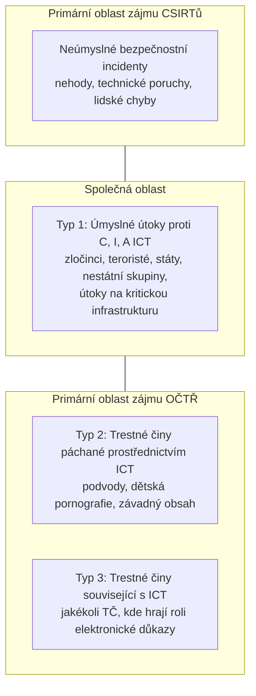
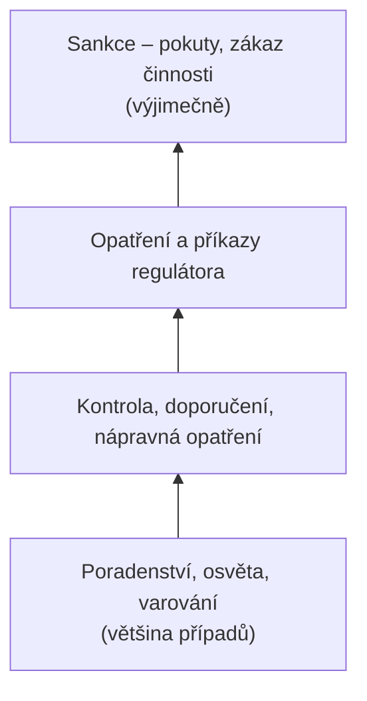
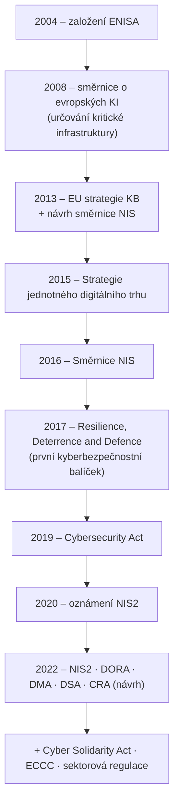
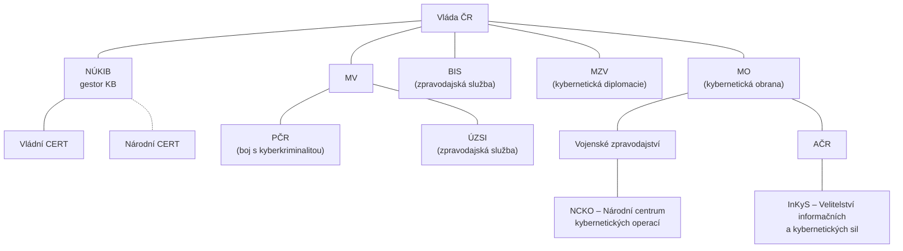

# P3 – Přístup k regulaci kybernetické bezpečnosti

← [[2 260922 - ISMS a role v organizaci|P2]] · [[0 PV017 - Přehled předmětu|Přehled]] · → [[4 261006 - Role řízení KB|P4]]

Slajdy: [[PV017_03_2026_Pristup_k_regulaci_kyberneticke_bezpecnosti.pdf]] (49 s.) · Přednášející: Pavel Loutocký (právník, MUNI Law)

> [!abstract] TL;DR
> - Kyberbezpečnost (CySec), InfoSec a ICT security se překrývají; CySec může být podkategorií, synonymem i nadřazeným pojmem InfoSec → [[Kybernetická bezpečnost (pojem)]].
> - Stát rozlišuje **kyberbezpečnost** (ochrana prostředí – NÚKIB, CSIRT), **kyberobranu** (suverenita – armáda, VZ) a **kyberkriminalitu** (trestné činy – OČTŘ) → [[Kyberbezpečnost, kyberobrana, kyberkriminalita]].
> - Chování lze regulovat **právem, sociálními normami, trhem a architekturou (kódem)** ([[Lessigovy modality regulace|Lessig]]); samotný trh selhává (externality, informační asymetrie…) → [[Selhání trhu v kyberbezpečnosti]].
> - EU volí přístup **založený na odolnosti** (resilience-based) → [[Přístupy k zajištění KB]].
> - Moderní regulace: **cílový stav místo konkrétní technologie** ([[Technologická neutralita]]), **podle rizika** ([[Rizikově orientovaný přístup]]), **mix nástrojů** ([[Regulatorní mix]]). Compliance je minimum, ne důkaz odolnosti → [[Compliance]].
> - Vývoj: ENISA (2004) → NIS (2016) → Cybersecurity Act (2019) → **[[NIS2]]**, DORA, CRA (2022+) → v ČR **[[ZoKB|zákon č. 264/2025 Sb.]]** účinný od **1. 11. 2025**; gestorem je **[[NÚKIB]]**.

---

## 1. Proč řešit kyberbezpečnost

*Slajdy [[PV017_03_2026_Pristup_k_regulaci_kyberneticke_bezpecnosti.pdf#page=2|2–7]]*

- Rostoucí digitalizace – ICT je všude; informační → znalostní společnost.
- **Informace se stala zbožím, informace znamená moc.**
- Rychlost rozvoje „kyber" neodpovídá naší schopnosti se přizpůsobit.
- CySec je stále **enormně podvyživený trh**.
- „A máte kyberbezpečnost? A mohla bych ji vidět?" → bezpečnost není věc, kterou lze ukázat; je to stav a proces.

### Incidenty, na kterých je vidět dopad

> [!example] Benešovský incident (slajd 4)
> Nemocnice Rudolfa a Stefanie v Benešově, **11. 12. 2019**; řetězec **Emotet → TrickBot → Ryuk**, skupina **Wizard Spider**. Pak další nemocnice v době COVID-19: FN Brno, PN Kosmonosy, Ostrava, Olomouc.
>
> *Kontext:* Emotet = vstupní loader šířený phishingem, TrickBot = bankovní trojan pro laterální pohyb a krádež přihlašovacích údajů, Ryuk = ransomware nasazený na konci.

| Rok | Incident | Pointa |
|---|---|---|
| 2010 | **Stuxnet** | státní kyberzbraň proti íránským jaderným zařízením, **první útok s fyzickými škodami** |
| 2013–14 | **Yahoo** | největší únik dat v historii, > 3 mld. účtů |
| 2017 | **Equifax** | osobní údaje ~147 mil. Američanů |
| 2017 | **WannaCry** | ransomware, > 300 000 PC ve > 150 zemích za pár dní |
| 2020 | **SolarWinds** | **útok na dodavatelský řetězec** přes škodlivé aktualizace |
| 2024 | **CrowdStrike** | **nebyl to útok**, ale chybná aktualizace Falconu → globální výpadek Windows (letectví, banky, nemocnice) |

### Kde jsme teď (ČR, 2025–2026) – slajd 6

- **Květen 2025 (28. 5.) – první veřejná atribuce v ČR**: kampaň **APT31 (ČLR)** proti neutajované síti **MZV**, probíhala od 2022; provedly ji společně NÚKIB, BIS, Vojenské zpravodajství a ÚZSI. Atribuce je akt **technický, zpravodajský i politický**.
- **NÚKIB za rok 2025: 203 incidentů**, z toho **2 velmi významné** (meziročně o 65 méně, ale **sofistikovanost roste**).
- **1. 11. 2025 – účinnost zákona č. 264/2025 Sb.** (nový [[ZoKB]]) s prováděcími vyhláškami; lhůty pro povinné subjekty běží i v roce 2026.

> [!quote] „Silver bullet" (slajd 7)
> Ultimátní řešení každé kyberkrize podle čtenářky novin: *„Já bych všechny ty internety a počítače zakázala."* → Žádné univerzální řešení neexistuje.

## 2. Co je kyberbezpečnost

*Slajdy [[PV017_03_2026_Pristup_k_regulaci_kyberneticke_bezpecnosti.pdf#page=8|8–14]]* · detail: [[Kybernetická bezpečnost (pojem)]]

**Definice ITU (zkráceně):** *Cybersecurity* je soubor nástrojů, politik, bezpečnostních konceptů, záruk, pokynů, přístupů k řízení rizik, akcí, školení, best practices, assurance a technologií, které lze použít k ochraně kyberprostředí a aktiv organizace a uživatelů (zařízení, personál, infrastruktura, aplikace, služby, telekomunikace, přenášené a uložené informace). Cíle: **1. dostupnost, 2. integrita** (může zahrnovat autenticitu a nepopiratelnost), **3. důvěrnost**.

**CySec × InfoSec × ICTSec** (slajdy 9–10):

| Pojem | Zdroj | Význam |
|---|---|---|
| **InfoSec** | ISO 27002 | zachování **důvěrnosti, integrity a dostupnosti informací**; bývá zahrnuta i infrastruktura a nosiče. Whitman & Mattord (2009) navrhují přidat *accuracy, authenticity, utility, possession* |
| **ICT security** | ISO 13335 | ochrana **přímo technologií** tvořících infrastrukturu; může být podkategorií InfoSec |
| **CySec** | – | může být **podkategorií, synonymem i nadřazeným pojmem** InfoSec (záleží na autorovi) |

**CIA triáda ve vrstvách** (slajd 11): uprostřed *Information*, kolem trojúhelník *Confidentiality – Integrity – Availability*, dále *Hardware – Software – Communication*, a vnější vrstvy **Physical → Personal → Organizational security**. → [[CIA triáda]]

**Základní pojmy** (slajdy 12–14): aktiva · hrozba (a **threat actor**) · zranitelnost · riziko · hodnocení (assessment) · risk management (zvládání rizik) · mitigace.

> [!quote] „Koloběh života" (slajd 13)
> Každá úroveň bezpečnosti je primárně o ochraně **aktiv** před nejrůznějšími **hrozbami**, které mohou skrze **zranitelnosti** ohrozit či narušit důvěrnost, integritu či dostupnost aktiv. **Riziko**, že se hrozba prostřednictvím zranitelnosti aktualizuje, se snažíme mitigovat skrze různé nástroje v rámci procesu **zvládání rizik**.
> - Hrozby: **vyšší moc, nedbalostní a úmyslné**; threat actor = např. hackerská skupina.
> - Kdo je nejslabší článek? → **člověk**.

- **Aktivum v KB** = cokoli či kdokoli dostupný skrze kyberprostor a **hodný ochrany**: hmotné i nehmotné statky, reputace, důvěra; obecně **lidé a cokoli v jejich zájmu**. → [[Aktivum]]

## 3. Kyberbezpečnost × kyberobrana × kyberkriminalita

*Slajdy [[PV017_03_2026_Pristup_k_regulaci_kyberneticke_bezpecnosti.pdf#page=15|15–18]]* · detail: [[Kyberbezpečnost, kyberobrana, kyberkriminalita]]

| | Kybernetická kriminalita | Kybernetická bezpečnost | Kybernetická obrana |
|---|---|---|---|
| Chrání | před **trestnou činností** | **prostředí (infrastrukturu)** | **suverenitu státu** |
| Gesce | OČTŘ, státní zastupitelství, soudy | **NÚKIB**, CERT/CSIRT týmy | armáda, bezpečnostní složky, **Vojenské zpravodajství** |

- **Kybernetická bezpečnost** – identifikuje, hodnotí a řeší hrozby v kyberprostoru, snižuje rizika a eliminuje dopady útoků, kriminality, kyberterorismu a špionáže; posiluje C, I, A dat, systémů a infrastruktury. **Hlavní smysl: ochrana prostředí k realizaci informačních práv člověka.**
- **Kybernetická obrana** – autonomní, specifická oblast širšího konceptu KB; **obrana státu** ve smyslu zákona o zajišťování obrany ČR (svrchovanost, územní celistvost, demokracie, právní stát, ochrana života a majetku před vnějším napadením).
- Úrovně odpovědnosti: jednotlivec a organizace × stát × mezinárodní pole.

**Prolínání CySec / CyCrime** (slajd 18):

## 4. Východiska a systematizace regulace

*Slajdy [[PV017_03_2026_Pristup_k_regulaci_kyberneticke_bezpecnosti.pdf#page=19|19–22]]*

- **Úrovně zabezpečení:** individuální → organizace → stát → mezinárodní společenství.
- **Východiska právní úpravy (4 napětí):** rigidita regulatorního aparátu · dynamika vývoje technologií a služeb · role definičních autorit · mezinárodní aspekty.
- **Systematizace KB (5 pilířů):** instituce · právo · spolupráce · budování kapacit · podpora.
- **Rozdělení rolí EU a ČR:**
  - právní úprava ČR je přímo závazná, orientovaná na ochranu informačního prostředí ČR,
  - pravomoci EU: výlučné, **sdílené** (jednotný trh, ochrana spotřebitele, spravedlnost a základní práva), **podpůrné** (civilní ochrana),
  - EU i ČR usilují o bezpečné prostředí přes **harmonizaci, regulaci a podpůrné nástroje**,
  - **právo EU má stále větší vliv** na regulaci KB v ČR (adopce, harmonizace).

## 5. Úvod do práva kybernetické bezpečnosti

*Slajdy [[PV017_03_2026_Pristup_k_regulaci_kyberneticke_bezpecnosti.pdf#page=23|23–28]]*

### Čím lze regulovat chování – Lessig (slajd 24)

→ [[Lessigovy modality regulace]]

| Modalita | Jak působí | Příklad v KB |
|---|---|---|
| **Právo** | hrozba sankce, působí **zpětně** | „Incident hlaste do 24 hodin, jinak pokuta." |
| **Sociální normy** | očekávání komunity | responsible disclosure, profesní etika, reputace |
| **Trh** | cena a poptávka | kybernetické pojištění, cena certifikace, náklady incidentu |
| **Architektura (kód)** | technicky vynucuje / znemožňuje | vynucené MFA, šifrování by default, sandbox |

### Proč nestačí trh – selhání trhu (slajd 25)

→ [[Selhání trhu v kyberbezpečnosti]]

- **Negativní externality** – nezabezpečené zařízení škodí třetím osobám (botnet, DDoS); náklady nese někdo jiný než ten, kdo „ušetřil".
- **Informační asymetrie** – kupující bezpečnost **neumí ověřit**.
- **Bezpečnost jako kvaziveřejný statek** – motivace k **černému pasažérství**.
- **Nesoulad motivací** – o zabezpečení rozhoduje ten, kdo nenese následky selhání.
- ⇒ Regulace má i **ekonomické**, nejen bezpečnostní odůvodnění.

### Celkový kontext datové legislativy (slajd 26)

Mapa EU legislativy (průmyslová politika, konektivita, data a privacy, IP, **kybernetická bezpečnost**, vymáhání práva, trust & security, e-commerce, hospodářská soutěž, média, finance). Sloupec kyberbezpečnosti obsahuje mj. Cybersecurity Act, NIS2, Cyber Resilience Act, Cyber Solidarity Act, ECCC regulation… → KB je **jen jeden díl skládačky** vedle GDPR, Data Act, AI Act, DSA/DMA atd.

### Druhy právní odpovědnosti (slajd 27)

- **pracovněprávní** – NDA, sledování uživatelů, „vpuštění útočníka",
- **správněprávní** – GDPR, odvětvová regulace (zdravotnictví, finance, telco); např. kyberútok za účelem získání vnitřní informace na kapitálovém trhu,
- **trestněprávní**,
- **mezinárodněprávní**.

### Proč je tu stát (slajd 28)

- **Distributivní práva** – lze je rozdělit a přiřadit jednotlivcům: vlastnictví, rodinný život, soukromí, duševní vlastnictví.
- **Nedistributivní práva** – nelze je individualizovat, musí být sdílena jako celek: **bezpečnost** (vč. kybernetické).
- **Hledání rovnováhy:** nedistributivní práva se konstruují **omezováním distributivních** – sama o sobě neexistují (např. bezpečnost vyžaduje omezení soukromí či vlastnických práv provozovatelů).

## 6. Přístupy k zajištění kybernetické bezpečnosti

*Slajd [[PV017_03_2026_Pristup_k_regulaci_kyberneticke_bezpecnosti.pdf#page=29|29]]* · detail: [[Přístupy k zajištění KB]]

| Přístup | Na co sází | Kde |
|---|---|---|
| **Deterrence theory** (odstrašení) | následky × pravděpodobnost selhání | – |
| **Informační** (information-based) | **vědět nebo najít** (sledování, sběr informací) | USA a autokratické/diktátorské režimy |
| **Odolnostní** (resilience-based) | snižování **pravděpodobnosti selhání**, schopnost odolat a obnovit se | **EU** |

## 7. Jak regulovat kybernetickou bezpečnost

*Slajdy [[PV017_03_2026_Pristup_k_regulaci_kyberneticke_bezpecnosti.pdf#page=30|30–36]]*

### Performativní pravidla (slajd 30)

- **Právní pojem je nástroj, nikoli popis skutečnosti** – definice se volí podle **účelu regulace**, ne podle technické přesnosti.
- Podstatná část regulace KB je **performativní** – *zakládá* kategorie subjektů, role odpovědných osob a pravomoci institucí (např. „poskytovatel regulované služby", „manažer KB").
- Takové pravidlo **nelze ověřit měřením, lze ho jen vyložit**; výklad je součástí bezpečnostní praxe, metodiky úřadu doplňují normu.
- ⇒ **Regulace cílového stavu / požadovaného dopadu!**

### Typy pravidel a volby regulátora (slajd 31)

- pravidla **deskriptivní / preskriptivní** · **performativní** · **chytrá** (smart regulation),
- **soulad (compliance) × právní odpovědnost**,
- **risk-based approach × plošný záběr**.

### Technologická neutralita (slajd 32) → [[Technologická neutralita]]

- Legislativní cyklus trvá **roky**, technologický **měsíce**.
- Ostré pravidlo zastará, otevřený standard ne → norma **odkazuje** (na technické normy), místo aby předepisovala konkrétní technologii.
- **Cenou je právní nejistota** – obsah povinnosti určí až praxe regulátora, auditora, rozhodovací praxe.

### Regulatorní mix (slajd 33) → [[Regulatorní mix]]

- **Command and control** – povinnost, kontrola, sankce,
- **ko-regulace a samoregulace** – normy a certifikace,
- **ekonomické nástroje** – pojištění, veřejné zakázky,
- **podpůrné nástroje** – hlášení, varování, CSIRT.
- **Chytrá regulace nevolí jeden nástroj, ale jejich pořadí** → **regulatorní pyramida**: od poradenství přes nápravu k sankci.

### Rizikově orientovaný přístup (slajd 34) → [[Rizikově orientovaný přístup]]

- **Plošná** regulace: stejná povinnost pro všechny × **rizikově orientovaná**: rozsah povinností podle **dopadu selhání**.
- Předpokládá schopnost riziko **identifikovat, hodnotit a doložit**.
- **Proporcionalita:** zásah **vhodný, potřebný a přiměřený**.
- Regulace má náklady: compliance, bariéra vstupu, odliv kapacit.
- Koho regulovat: **provozovatele, výrobce, dodavatele, či uživatele?**

### Compliance a bezpečnost (slajd 35) → [[Compliance]]

| Meze compliance | Přínos compliance |
|---|---|
| splněný audit **není důkazem odolnosti** | stanoví **minimální úroveň** zabezpečení |
| kontroluje se dokumentace, **útok míří na systém** | bez měřitelné povinnosti **není odpovědnost** |
| nejistota v přístupu, nutná škálovatelnost | doložený postup rozhoduje o **zavinění a náležité péči** |

### Limity práva v kyberprostoru (slajd 36)

- **Teritorialita:** jurisdikce končí na hranici, útok ne.
- **Atribuce je podmínkou odpovědnosti** – technická analýza + zpravodajství + politické rozhodnutí (ČR 28. 5. 2025: APT31 vs. MZV).
- **Vymahatelnost** vůči pachateli v cizím státě je omezená; incident trvá minuty, řízení roky.
- ⇒ **Regulace proto míří na provozovatele, nikoli na útočníka.**

## 8. Právní úprava EU

*Slajdy [[PV017_03_2026_Pristup_k_regulaci_kyberneticke_bezpecnosti.pdf#page=37|37–41]]* · detail: [[Vývoj regulace KB v EU]], [[NIS2]]

- **ENISA (2004)** – posílit spolupráci orgánů, pomoc se zvládáním incidentů, vzdělávání.
- **Směrnice o evropských KI (2008)** – určování a označování evropské kritické infrastruktury (rozdílné definice napříč EU); definice sektorů a služeb esenciálních pro stát → posléze vyčlenění KII. „Poprvé se začalo mluvit o tom, že se s těmi internety možná bude muset něco udělat."
- **Směrnice NIS (2016)** – první unijní počin takového rozsahu; přesvědčit státy trvalo téměř 3 roky; účinnost 2016, **21 měsíců na implementaci**. **Tři pilíře:**
  1. **budování kapacit** – národní CERT týmy a národní autorita,
  2. **mezinárodní spolupráce** – Skupina pro spolupráci, síť CSIRT,
  3. **posílení KB v klíčových sektorech** – banky, pitná voda, zdravotnictví…; **základní služby a digitální služby**.
- **Ale…** 2015–2017 se ukázalo, že jednotný digitální trh bez CySec nevznikne: chybí compliance nástroje, mandát ENISA, finance, kapacity, nedostatečná implementace NIS → 2017 společné prohlášení **„Resilience, Deterrence and Defence"**: plán koordinované reakce na přeshraniční incidenty (blueprint), návrh Cybersecurity Act.
- **…a proto:** 2019 **Cybersecurity Act** · 2022 **NIS2**, **DORA**, **DMA**, **DSA**, **Cyber Resilience Act** · + **CSolA** (Cyber Solidarity Act), **ECCC**, sektorová regulace.

> [!info] Kontext navíc – čísla a data předpisů
> - Směrnice NIS = (EU) 2016/1148 · Cybersecurity Act = nařízení (EU) 2019/881 (trvalý mandát ENISA + evropský rámec certifikace, např. **EUCC**)
> - NIS2 = směrnice (EU) 2022/2555 · DORA = nařízení (EU) 2022/2554 (finanční sektor, použitelné od 17. 1. 2025)
> - **CRA** byl v roce 2022 *navržen*; přijat jako nařízení **(EU) 2024/2847**, v platnosti od 10. 12. 2024, **povinnosti hlášení od 11. 9. 2026**, plná použitelnost od 11. 12. 2027 → [[CRA]]
> - Směrnice = nutná transpozice do národního práva (NIS2 → ZoKB); nařízení = přímo použitelné (DORA, CRA).

## 9. Vývoj právní úpravy v ČR

*Slajdy [[PV017_03_2026_Pristup_k_regulaci_kyberneticke_bezpecnosti.pdf#page=42|42–47]]* · detail: [[NÚKIB]], [[Instituce KB v ČR]], [[ZoKB]]

- Dříve KB řešena **individuálně, bez koordinace státem**; národní koordinátoři: Ministerstvo informatiky (částečně, do 2007) → Ministerstvo vnitra (2007–2011).
- **19. 10. 2011** – vláda ustanovila **NBÚ** národní autoritou pro KB; úkoly: vybudovat **NCKB**, **ZoKB**, Radu pro KB, specializovanou instituci, legislativní ukotvení.
- **1. 8. 2017** – NBÚ + NCKB → vzniká **NÚKIB** (Národní úřad pro kybernetickou a informační bezpečnost).
- **Národní strategie KB na období 2026–2030** (slajd 44) – role klíčových institucí:

Legenda barev na slajdu: **bezpečnost strategické infrastruktury** (NÚKIB, CERTy) · **boj s kyberkriminalitou** (PČR) · **zpravodajské služby** (BIS, ÚZSI, VZ) · **kybernetická diplomacie** (MZV) · **kybernetická obrana** (MO, AČR, NCKO, InKyS).

**Další organizace** (slajd 45): Výbor pro kybernetickou bezpečnost (při BRS) · NÚKIB a Vládní CERT · Národní CERT (CSIRT.CZ) · **NCOZ** (Národní centrála proti organizovanému zločinu) · ÚZSI · Vojenský CERT (CIRC) · Velitelství informačních a kybernetických sil · NCKO · BIS.

**Právní úprava ČR** (slajdy 46–47):
- zákon č. **240/2000 Sb.**, krizový zákon + NV č. **432/2010 Sb.** o kritériích pro určení prvku kritické infrastruktury,
- *starý* zákon č. **181/2014 Sb.**, o kybernetické bezpečnosti,
- (SK) zákon č. 69/2018 Z. z., o kybernetickej bezpečnosti,
- **nový zákon č. 264/2025 Sb., o kybernetické bezpečnosti – účinný od 1. 11. 2025** (implementace NIS2; NÚKIB vydal průvodce novým zákonem).

## 10. Checklist k zamyšlení (slajd 49)

1. Regulovat všechny stejně, nebo podle míry rizika?
2. Koho zavazovat – provozovatele, výrobce, nebo uživatele?
3. Znamená splnění povinností i skutečnou bezpečnost?
4. Může právo držet krok s technologií?
5. Je účinnější regulovat zákonem, nebo technickým nastavením?

> [!tip] Jak na checklist odpovídat
> 1 → [[Rizikově orientovaný přístup]] + proporcionalita · 2 → regulace míří na provozovatele (útočník je nevymahatelný), CRA nově na výrobce · 3 → [[Compliance]] je minimum, ne důkaz odolnosti · 4 → [[Technologická neutralita]] (odkaz na standardy, cena = nejistota) · 5 → [[Lessigovy modality regulace|Lessig]] – kód vynucuje ex ante, právo sankcionuje ex post; ideál je mix.

---

## Otázky k procvičení

> [!question]- 1. Jaký je vztah mezi CySec, InfoSec a ICT security?
> InfoSec (ISO 27002) = zachování C, I, A informací (vč. infrastruktury a nosičů). ICT security (ISO 13335) = ochrana samotných technologií, podkategorie InfoSec. CySec může být podkategorií, synonymem i nadřazeným pojmem InfoSec – záleží na kontextu a autorovi.

> [!question]- 2. Rozliš kyberbezpečnost, kyberobranu a kyberkriminalitu a uveď gestory.
> Kyberkriminalita – ochrana před trestnou činností (OČTŘ, SZ, soudy). Kyberbezpečnost – ochrana prostředí/infrastruktury (NÚKIB, CERT/CSIRT). Kyberobrana – ochrana suverenity státu dle zákona o zajišťování obrany (armáda, VZ).

> [!question]- 3. Co jsou podle prolínání CySec/CyCrime útoky typu 1, 2 a 3? Který typ je ve společné oblasti?
> Typ 1 = úmyslné útoky proti C, I, A ICT (**společná oblast** CSIRT i OČTŘ). Typ 2 = trestné činy páchané **prostřednictvím** ICT (podvody, závadný obsah). Typ 3 = trestné činy **související** s ICT (elektronické důkazy). Neúmyslné incidenty jsou primárně doménou CSIRTů.

> [!question]- 4. Vyjmenuj Lessigovy čtyři modality regulace s příkladem z KB.
> Právo (povinnost hlásit incident do 24 h pod pokutou) · sociální normy (responsible disclosure) · trh (kyberpojištění) · architektura/kód (vynucené MFA, šifrování by default).

> [!question]- 5. Proč v KB selhává trh? Uveď čtyři důvody.
> Negativní externality (botnet škodí třetím) · informační asymetrie (kupující neověří bezpečnost) · bezpečnost jako kvaziveřejný statek (černí pasažéři) · nesoulad motivací (rozhoduje ten, kdo nenese následky).

> [!question]- 6. Co jsou distributivní a nedistributivní práva a jak spolu souvisí?
> Distributivní lze přidělit jednotlivcům (vlastnictví, soukromí). Nedistributivní nelze individualizovat, musí být sdílena (bezpečnost). Nedistributivní práva vznikají **omezováním distributivních** – sama o sobě neexistují.

> [!question]- 7. (test) Který přístup k zajištění KB je typický pro EU? a) deterrence · b) information-based · c) resilience-based · d) market-based
> **c) resilience-based** (odolnostní). Information-based je typický pro USA a autokratické režimy.

> [!question]- 8. Co znamená, že regulace KB je „performativní"?
> Právní pojmy jsou nástroje zvolené podle účelu, ne popis reality; pravidla **zakládají** kategorie subjektů, role a pravomoci. Nelze je ověřit měřením, jen vyložit – výklad (metodiky úřadu) je součástí praxe. Reguluje se **cílový stav / dopad**.

> [!question]- 9. Co je technologická neutralita, proč se používá a jaká je její cena?
> Zákon nepředepisuje konkrétní technologii, ale odkazuje na standardy / cílový stav, protože legislativní cyklus (roky) nestíhá technologický (měsíce). Cenou je **právní nejistota** – obsah povinnosti dotváří praxe regulátora a auditorů.

> [!question]- 10. Co je regulatorní mix a regulatorní pyramida?
> Mix = kombinace command-and-control, ko/samoregulace (normy, certifikace), ekonomických nástrojů (pojištění, zakázky) a podpůrných nástrojů (hlášení, varování, CSIRT). Chytrá regulace volí jejich **pořadí** – pyramida od poradenství přes nápravu po sankci.

> [!question]- 11. Jaké jsou meze a přínosy compliance?
> Meze: audit není důkaz odolnosti, kontroluje se dokumentace (útok míří na systém), nejistota. Přínosy: minimální úroveň, bez měřitelné povinnosti není odpovědnost, doložený postup rozhoduje o zavinění a náležité péči.

> [!question]- 12. Proč regulace míří na provozovatele, a ne na útočníka?
> Teritorialita (jurisdikce končí na hranici), atribuce je obtížná a je zároveň politickým aktem, vymahatelnost vůči pachateli v cizině je omezená a řízení trvá roky.

> [!question]- 13. Jaké jsou tři pilíře směrnice NIS?
> Budování kapacit (národní CERT a autorita) · mezinárodní spolupráce (Skupina pro spolupráci, síť CSIRT) · posílení KB v klíčových sektorech (základní a digitální služby).

> [!question]- 14. (test) Od kdy je účinný zákon č. 264/2025 Sb. o kybernetické bezpečnosti? a) 1. 1. 2015 · b) 17. 10. 2024 · c) 1. 11. 2025 · d) 1. 8. 2017
> **c) 1. 11. 2025.** (1. 1. 2015 = starý ZoKB 181/2014; 17. 10. 2024 = termín transpozice NIS2; 1. 8. 2017 = vznik NÚKIB.)

> [!question]- 15. Kdy a jak vznikl NÚKIB a kdo byl národní autoritou před ním?
> 19. 10. 2011 se národní autoritou stal **NBÚ** (s NCKB); **1. 8. 2017** vznikl samostatný **NÚKIB**. Ještě dříve koordinovalo Ministerstvo informatiky (do 2007) a MV (2007–2011).

> [!question]- 16. Co byla první veřejná atribuce kyberútoku v ČR?
> 28. 5. 2025 – kampaň **APT31** (ČLR) proti neutajované síti **MZV** (od 2022); atribuovaly NÚKIB, BIS, VZ a ÚZSI.

## Souvislosti

- Navazuje: [[4 261006 - Role řízení KB|P4]] (jak regulaci převést do řízení), P9 (právní rámec ZoKB, NIS2, CRA, GDPR podrobně), P12 (certifikace, dodavatelské řetězce)
- Pojmy: [[Kybernetická bezpečnost (pojem)]] · [[Kyberbezpečnost, kyberobrana, kyberkriminalita]] · [[Lessigovy modality regulace]] · [[Selhání trhu v kyberbezpečnosti]] · [[Přístupy k zajištění KB]] · [[Technologická neutralita]] · [[Regulatorní mix]] · [[Rizikově orientovaný přístup]] · [[Compliance]] · [[Vývoj regulace KB v EU]] · [[NIS2]] · [[CRA]] · [[ZoKB]] · [[NÚKIB]] · [[Instituce KB v ČR]]
- [[PV017 - Glosář|Glosář]]
