# P4 – Role řízení kybernetické bezpečnosti

← [[3 260929 - Přístup k regulaci KB|P3]] · [[0 PV017 - Přehled předmětu|Přehled]]

Slajdy: [[PV017_04_2026_Role_rizeni_kyberneticke_bezpecnosti.pdf]] (43 s.) · Přednášející: Václav Stupka (MUNI Law)

Osnova: **proč** řízení KB → **compliance** a regulace → **jak** řízení funguje (PDCA, rizika, rozsah, rámce) → **procesy** → **vnitřní předpisy** → **role**.

> [!abstract] TL;DR
> - **Regulace říká CO, řízení říká JAK.** Řízení je *převodník* mezi zákonem a praxí; výsledkem je **odolnost + doložitelnost**.
> - Tři úrovně: **governance** (vedení – směr, apetit k riziku) · **management** (CISO – plánování, měření) · **operations** (IT, SOC – výkon) → [[Governance, management a provoz]].
> - [[Compliance]] = *prokazatelně* dodržovat povinnosti (právní, smluvní, dobrovolné) a **doložit to**. „Implement once, comply many." Compliance je **minimum, ne cíl**.
> - **Odpovědnost nese vedení** – NIS2 čl. 20, DORA čl. 5, péče řádného hospodáře → nelze „delegovat a zapomenout" → [[Odpovědnost vedení]].
> - Motor řízení = **[[Řízení rizik]]**; strategie: snížit · přenést · vyhnout se · akceptovat (o zbytkovém riziku **prokazatelně rozhoduje vedení**).
> - Incidenty dle NIS2 čl. 23: **24 h** včasné varování · **72 h** oznámení · **1 měsíc** závěrečná zpráva → [[Hlášení incidentů]].
> - [[Vnitřní předpisy]] platí, jen když jsou **schválené, prokazatelně seznámené, aktuální a vymáhané**; dodavatele zavazuje **jen smlouva**.
> - Role: [[Model tří linií]] (výkon · dohled · nezávislá kontrola), [[Bezpečnostní role]] dle vyhl. 409/2025, [[RACI]] (vždy jen jedno A), CISO **nemá být pod IT**.

---

## 1. Proč řízení kybernetické bezpečnosti

### Regulace říká CO, řízení říká JAK

*Slajd [[PV017_04_2026_Role_rizeni_kyberneticke_bezpecnosti.pdf#page=4|4]]*

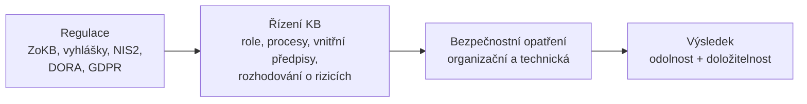

> [!quote] „Zákon nepředepisuje konkrétní firewall. Vyžaduje, aby organizace **věděla, proč má která opatření, kdo za ně odpovídá – a uměla to doložit**."

### Tři úrovně: řízení, správa, provoz

*Slajd [[PV017_04_2026_Role_rizeni_kyberneticke_bezpecnosti.pdf#page=5|5]]* · detail: [[Governance, management a provoz]]

| Úroveň | Co dělá | Kdo |
|---|---|---|
| **Governance – řízení** | směr, odpovědnost, dohled, **apetit k riziku** | vrcholné vedení, výbor pro řízení KB |
| **Management – správa** | plánování, zavádění, měření, zlepšování | manažer KB / CISO, architekt KB |
| **Operations – provoz** | každodenní výkon opatření, monitoring, reakce | IT provoz, SOC, garanti aktiv, uživatelé |

Viz **ISO/IEC 27014** (governance IB) a **NIST CSF 2.0** – nová funkce **GOVERN** (2024).

### Bezpečnost není jen technologie

*Slajd [[PV017_04_2026_Role_rizeni_kyberneticke_bezpecnosti.pdf#page=6|6]]*

| Lidé | Procesy | Technologie |
|---|---|---|
| role a odpovědnosti | řízení rizik, změn, incidentů | ochrana sítí a koncových bodů |
| kompetence a vzdělávání | vnitřní předpisy | řízení identit a přístupů (IAM) |
| bezpečnostní kultura | měření a přezkum | logování a detekce |
| zastupitelnost | řízení dodavatelů | zálohování, šifrování |

**Řízení KB drží tyto složky pohromadě a v rovnováze.**

> [!quote] „Technologie bez procesu je nespravovaná. Proces bez lidí je jen papír. Lidé bez nástrojů nestíhají."

## 2. Compliance a regulace

### Co je compliance

*Slajd [[PV017_04_2026_Role_rizeni_kyberneticke_bezpecnosti.pdf#page=8|8]]* · detail: [[Compliance]]

> **Compliance = schopnost organizace prokazatelně dodržovat povinnosti, které se na ni vztahují – a doložit to.**

| Právní povinnosti | Smluvní povinnosti | Dobrovolně převzaté |
|---|---|---|
| zákon č. 264/2025 Sb. ([[ZoKB]]) a vyhlášky | požadavky zákazníků a partnerů | ISO/IEC 27001 – certifikace |
| [[NIS2]], [[DORA]], [[CRA]] | podmínky kybernetického pojištění | kodexy a oborové standardy |
| [[GDPR]] čl. 32 – zabezpečení zpracování | SLA a bezpečnostní přílohy smluv | vlastní politiky a směrnice |
| sektorová regulace | | veřejné závazky organizace |

### Od regulace ke compliance (cyklus)

*Slajd [[PV017_04_2026_Role_rizeni_kyberneticke_bezpecnosti.pdf#page=9|9]]*

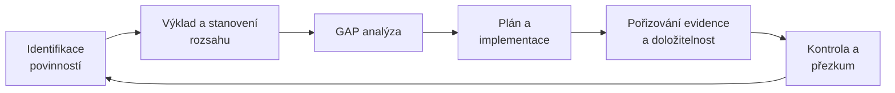

↻ Cyklus se opakuje – **mění se regulace, organizace i hrozby**.

### Nový ZoKB vtahuje řízení přímo do zákona

*Slajd [[PV017_04_2026_Role_rizeni_kyberneticke_bezpecnosti.pdf#page=10|10]]* · detail: [[ZoKB]]

| Zákon č. 264/2025 Sb. | Vyhl. **409/2025** Sb. – **vyšší** režim | Vyhl. **410/2025** Sb. – **nižší** režim |
|---|---|---|
| stanovit **rozsah** řízení KB | § 3 systém řízení bezpečnosti informací | vedení určí **osobu pověřenou KB** a svěří jí pravomoci |
| zavádět bezpečnostní opatření | § 4 povinnosti **vrcholného vedení**, **výbor pro řízení KB** | **prokazatelné školení vedení** |
| **hlásit** kybernetické incidenty | § 5 **bezpečnostní role** | zajištění zdrojů, přehled o plnění opatření |
| zavádět **protiopatření NÚKIB** | § 6 bezpečnostní politika a dokumentace | bezpečnostní politika a dokumentace, pravidelný přezkum |
| promítnout požadavky **do smluv s dodavateli** | řízení rizik, dodavatelů, incidentů… | |

### Odpovědnost nese vedení

*Slajd [[PV017_04_2026_Role_rizeni_kyberneticke_bezpecnosti.pdf#page=11|11]]* · detail: [[Odpovědnost vedení]]

| Předpis | Co říká |
|---|---|
| **NIS2 čl. 20** | řídicí orgány **schvalují** opatření k řízení rizik, **dohlížejí** na ně, **odpovídají** za porušení a **musí se školit** |
| **NIS2 čl. 32 odst. 5** | u **základních** subjektů možnost **dočasného zákazu výkonu řídicí funkce** |
| **DORA čl. 5** | řídicí orgán nese **konečnou odpovědnost** za řízení ICT rizik finanční entity |
| **OZ § 159, ZOK § 51** | **péče řádného hospodáře**; ochrana jen při **informovaném rozhodnutí v dobré víře** (business judgment rule) |

**Důsledek:** vedení nemůže KB „delegovat a zapomenout" – potřebuje řízení, které mu **dodá informace pro rozhodnutí**.

### Jeden systém řízení, mnoho regulací

*Slajd [[PV017_04_2026_Role_rizeni_kyberneticke_bezpecnosti.pdf#page=12|12]]*

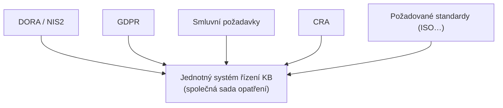

**„Implement once, comply many"** – jedna sada opatření pokryje více regulací.

### Compliance vs. bezpečnost

*Slajd [[PV017_04_2026_Role_rizeni_kyberneticke_bezpecnosti.pdf#page=13|13]]*

| Compliance **bez** řízení | Compliance **skrze** řízení |
|---|---|
| „papírová bezpečnost" – dokumenty pro kontrolu | dokumenty popisují **skutečný stav** |
| jednorázový projekt před auditem | **kontinuální proces (PDCA)** |
| opatření bez vazby na rizika | opatření **odvozená z analýzy rizik** |
| nikdo neví, zda opatření fungují | účinnost se **měří a vyhodnocuje** |
| odpovědnost rozmazaná | **jasní vlastníci a role** |

> [!important] Compliance je minimum, ne cíl. Řízení z ní dělá **vedlejší produkt** dobré bezpečnosti.

## 3. Jak řízení funguje

### PDCA a vazba na ISO/IEC 27001:2022

*Slajd [[PV017_04_2026_Role_rizeni_kyberneticke_bezpecnosti.pdf#page=15|15]]* · detail: [[PDCA]]

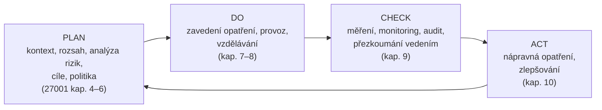

> [!warning] Nejčastěji se šetří na **CHECK a ACT** – a právě tam vzniká **papírová bezpečnost**.

### Rozsah řízení (scope)

*Slajd [[PV017_04_2026_Role_rizeni_kyberneticke_bezpecnosti.pdf#page=16|16]]* · detail: [[Rozsah řízení (scope)]]

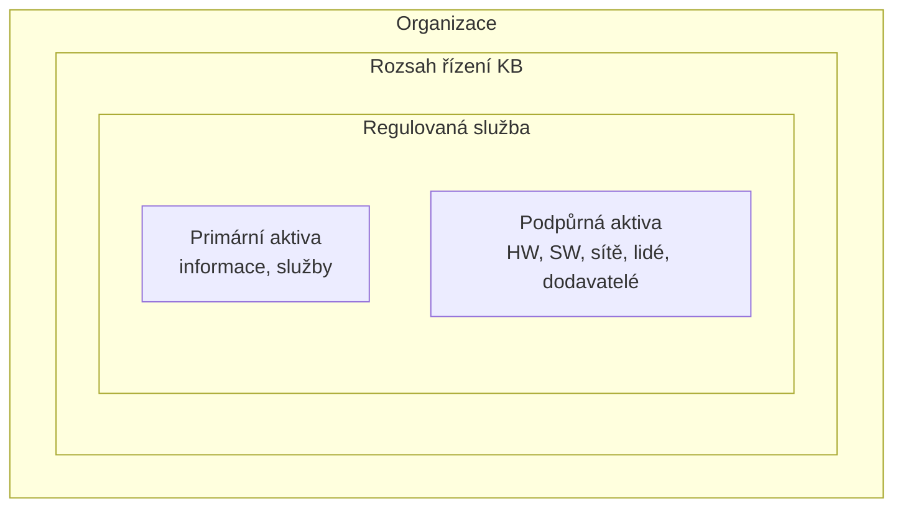

1. Identifikuj **primární aktiva** celé organizace.
2. Urči ta, která souvisejí s **regulovanou službou**.
3. Urči související **organizační části a podpůrná aktiva**.
4. Tím je dán rozsah – **dokud není určen, platí pro celou organizaci**.

### Rámce a standardy pro řízení KB

*Slajd [[PV017_04_2026_Role_rizeni_kyberneticke_bezpecnosti.pdf#page=17|17]]* · detail: [[Rámce řízení KB]]

| Rámec | Zaměření | Typické využití |
|---|---|---|
| **ISO/IEC 27001 / 27002** | systém řízení bezpečnosti informací, katalog opatření | certifikace, základ ISMS |
| **NIST CSF 2.0** | Govern · Identify · Protect · Detect · Respond · Recover | strategie, komunikace s vedením |
| **CIS Controls v8** | prioritizovaná technická opatření | praktický start, menší organizace |
| **COBIT 2019** | governance a řízení podnikového IT | audit IT, vazba na řízení podniku |
| **IEC 62443** | bezpečnost průmyslových řídicích systémů | OT, výroba, energetika |
| **ISO 22301** | řízení kontinuity činností | BCM, odolnost služeb |

Podrobněji: ISMS (**20. 10.**), standardy a Common Criteria (**27. 10.**).

## 4. Procesy řízení kybernetické bezpečnosti

### Klíčové procesy

*Slajd [[PV017_04_2026_Role_rizeni_kyberneticke_bezpecnosti.pdf#page=19|19]]*

| Řídicí | Ochranné | Reakce a obnova |
|---|---|---|
| řízení rizik | řízení přístupů a identit | logování a monitoring |
| řízení aktiv | řízení změn | řízení incidentů |
| řízení dodavatelů | řízení zranitelností a záplat | kontinuita a obnova |
| audit a přezkum | bezpečnost lidských zdrojů | zálohování |

**Každý proces má: vlastníka · předpis · záznamy · metriku.**

### Řízení rizik jako motor řízení KB

*Slajd [[PV017_04_2026_Role_rizeni_kyberneticke_bezpecnosti.pdf#page=20|20]]* · detail: [[Řízení rizik]]

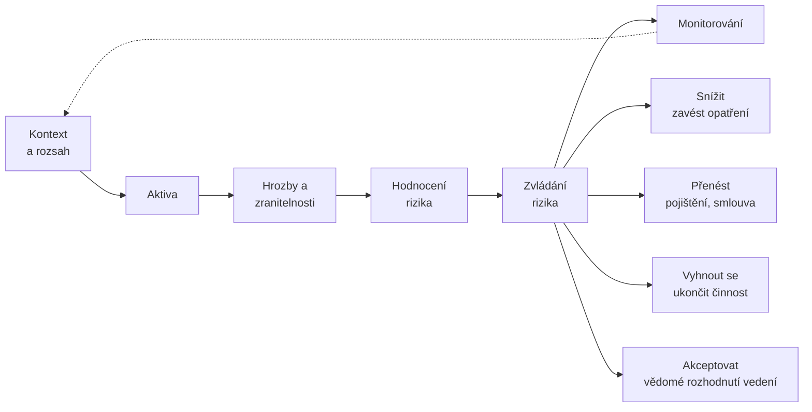

- **Kdo rozhoduje?** Analýzu připravuje **manažer KB s garanty aktiv**. O přijatelnosti **zbytkových rizik prokazatelně rozhoduje vedení**.
- **Výstupy:** registr aktiv · registr rizik · plán zvládání rizik · prohlášení o aplikovatelnosti (SoA).

### Řízení dodavatelů

*Slajd [[PV017_04_2026_Role_rizeni_kyberneticke_bezpecnosti.pdf#page=21|21]]* · detail: [[Řízení dodavatelů]]

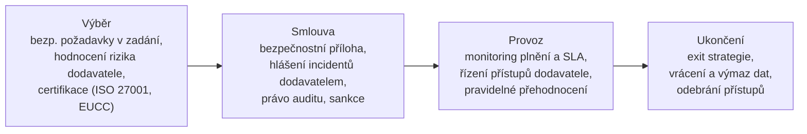

> [!warning] Vnitřní předpis dodavatele **nezavazuje**. **Co není ve smlouvě, nelze vymáhat.**

### Měření, audit a přezkoumání

*Slajd [[PV017_04_2026_Role_rizeni_kyberneticke_bezpecnosti.pdf#page=22|22]]*

| Metriky | Audit | Přezkoumání vedením |
|---|---|---|
| % systémů s aktuálními záplatami | interní audit KB – **nezávislost** | **minimálně 1× ročně** |
| průměrná doba detekce a reakce (MTTD/MTTR) | externí certifikační audit | výbor pro řízení KB |
| míra prokliku při phishingové simulaci | kontrola NÚKIB | rozhodnutí o zdrojích a rizicích |
| % účtů s vícefaktorovou autentizací | penetrační testy a cvičení | nápravná opatření |

> [!quote] „Co se neměří, to se neřídí – a nelze to ani doložit."

### Řízení incidentů a hlášení

*Slajd [[PV017_04_2026_Role_rizeni_kyberneticke_bezpecnosti.pdf#page=23|23]]* · detail: [[Hlášení incidentů]]

Lhůty **NIS2 čl. 23** (transponováno do ZoKB):

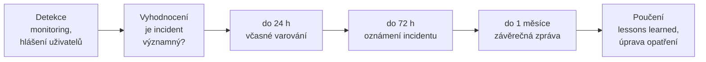

| Řízení musí **předem** určit | Souběh povinností |
|---|---|
| **kdo vyhodnocuje** a **kdo rozhoduje** o hlášení | **GDPR čl. 33 – 72 h ÚOOÚ** (osobní údaje) |
| kontakty na NÚKIB / CSIRT a **zastupitelnost** | DORA, sektorové předpisy, smluvní povinnosti |

## 5. Vnitřní předpisy

*Slajdy [[PV017_04_2026_Role_rizeni_kyberneticke_bezpecnosti.pdf#page=25|25–31]]* · detail: [[Vnitřní předpisy]]

### Proč vnitřní předpisy

Zákon a vyhláška + normy (ISO) + smlouvy → **vnitřní předpis** (politika, směrnice, postup) → **konkrétní chování** (kdo, co, kdy a jak dělá).

Vnitřní předpis:
1. **konkretizuje** obecné povinnosti na pravidla,
2. **přiděluje** odpovědnosti a pravomoci,
3. **zavazuje** zaměstnance k dodržování,
4. **dokládá** náležitou péči vůči regulátorovi i soudu.

### Hierarchie bezpečnostní dokumentace

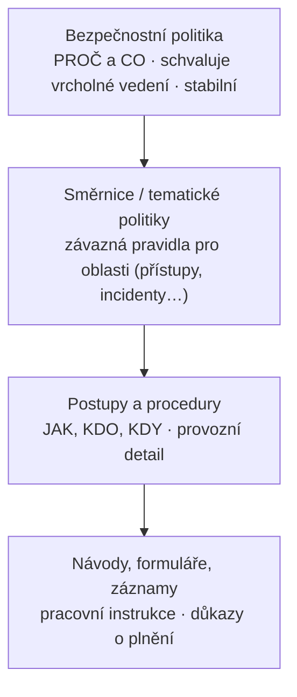

**Čím níže, tím detailnější, častěji měněné a schvalované na nižší úrovni.**

### Typická bezpečnostní dokumentace (slajd 27)

| Řídicí dokumenty | Tematické politiky a směrnice |
|---|---|
| bezpečnostní politika (politika ISMS) | řízení přístupu a identit |
| metodika řízení rizik | klasifikace a ochrana informací |
| registr aktiv a registr rizik | přijatelné užívání (**AUP**) |
| prohlášení o aplikovatelnosti (**SoA**) | řízení incidentů a kontinuita (**BCP/DRP**) |
| plán zvládání rizik | řízení změn, zálohování, kryptografie |
| plán vzdělávání a rozvoje bezpečnostního povědomí | řízení dodavatelů, bezpečný vývoj |

### Závaznost: zaměstnanci (slajd 28)

| § 305 zákoníku práce (vnitřní předpis) | § 301 zákoníku práce (povinnosti zaměstnance) |
|---|---|
| závazný pro zaměstnavatele i **všechny zaměstnance** | zaměstnanec plní pokyny nadřízených |
| **písemně, bez zpětné účinnosti** | dodržuje předpisy vztahující se k vykonávané práci… |
| nesmí být v rozporu s právními předpisy | **… pokud s nimi byl řádně seznámen** |
| **seznámení do 15 dnů**, musí být přístupný | |
| uchovává se **10 let** | |

> [!important] Klíčové je **prokazatelné seznámení** – podpis, potvrzení v e-learningu, evidence verzí. **Vyhláška 409/2025 Sb.** vyžaduje jeho **strukturované potvrzení**.

### Závaznost: vůči komu a čím se vynucuje (slajd 29)

| Kdo | Základ závaznosti | Vynucení |
|---|---|---|
| **Zaměstnanci** | pracovní povinnost (§ 301 ZP) | výtka · výpověď **§ 52 písm. g)** · okamžité zrušení **§ 55** · náhrada škody |
| **Vedení a statutáři** | péče řádného hospodáře, **NIS2 čl. 20** | odpovědnost vůči společnosti, sankce regulátora |
| **Dodavatelé** | **nezavazuje! jen přes smlouvu** | smluvní pokuty, odstoupení, náhrada škody |
| **Externisté a uživatelé** | smlouva, NDA, podmínky užívání | smluvní sankce, **odebrání přístupu** |

### Aby předpis skutečně platil (slajd 30)

- ✓ **schválen oprávněnou osobou** (politiku schvaluje vedení),
- ✓ **prokazatelně seznámeni** všichni dotčení,
- ✓ **srozumitelný** a v praxi **proveditelný**,
- ✓ **v souladu se zákonem** (např. monitoring zaměstnanců – **§ 316 ZP**, GDPR),
- ✓ **aktuální** – přezkum **min. 1× ročně**, verzování,
- ✓ **kontrolován a vymáhán**.

> [!warning] Nevymáhaný předpis je horší než žádný
> Dává signál, že pravidla neplatí, a **oslabuje pozici organizace** při sporu i kontrole.

### Životní cyklus vnitřního předpisu (slajd 31)

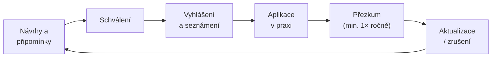

Uprostřed cyklu: **řízená dokumentace**. **Spouštěče mimořádného přezkumu:** nová či změněná regulace · závažný incident · výsledek auditu či kontroly · reorganizace, nový systém nebo dodavatel · změna hrozeb (varování NÚKIB).

## 6. Role v řízení kybernetické bezpečnosti

### Model tří linií (IIA, 2020)

*Slajd [[PV017_04_2026_Role_rizeni_kyberneticke_bezpecnosti.pdf#page=33|33]]* · detail: [[Model tří linií]]

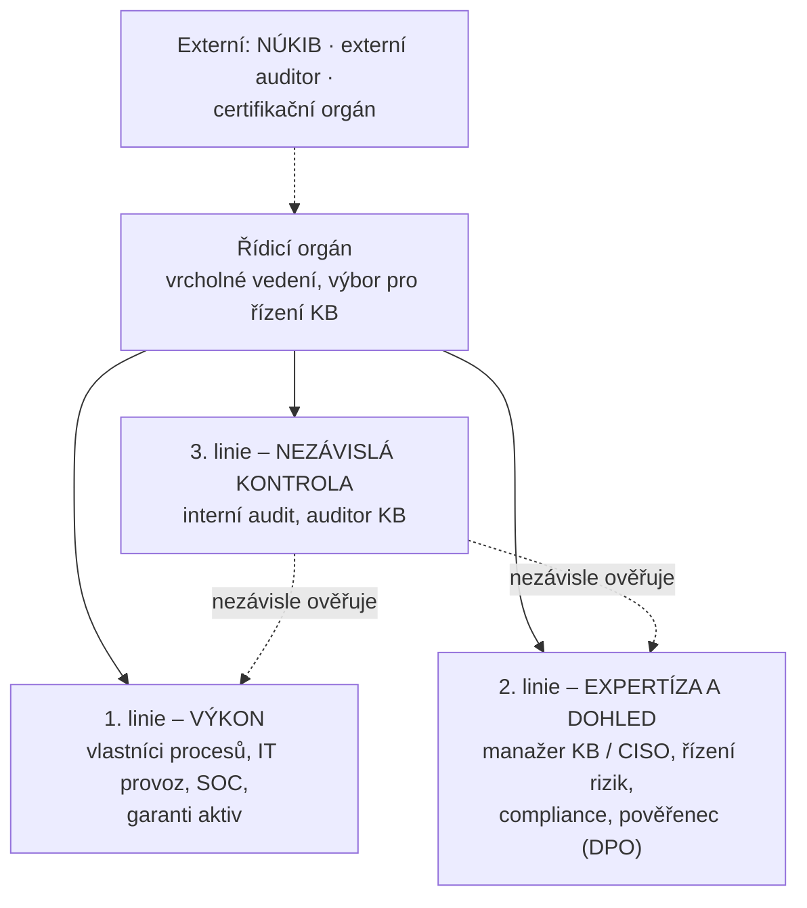

### Bezpečnostní role dle vyhl. 409/2025 Sb.

*Slajd [[PV017_04_2026_Role_rizeni_kyberneticke_bezpecnosti.pdf#page=34|34]]* · detail: [[Bezpečnostní role]]

| Role | Náplň |
|---|---|
| **Vrcholné vedení** | schvaluje politiku, zajišťuje zdroje, **rozhoduje o rizicích**, určuje role |
| **Výbor pro řízení KB** | koordinace a dohled; **člen vedení + manažer KB**; zasedá **min. 1× ročně** |
| **Manažer KB** | řídí a rozvíjí systém řízení bezpečnosti; **hlavní kontaktní osoba** |
| **Architekt KB** | navrhuje bezpečnostní architekturu a technická opatření |
| **Garant aktiva** | odpovídá za konkrétní aktivum – jeho rozvoj, užívání a bezpečnost |
| **Auditor KB** | nezávisle ověřuje soulad a účinnost; **nesmí auditovat sám sebe** |

**Nižší režim (vyhl. 410/2025 Sb.):** vedení určí **osobu pověřenou kybernetickou bezpečností** a svěří jí potřebné pravomoci.

### Kyberbezpečnost není jen věcí „bezpečáků"

*Slajd [[PV017_04_2026_Role_rizeni_kyberneticke_bezpecnosti.pdf#page=35|35]]*

1. **IT provoz a SOC** – provoz opatření, monitoring, reakce na incidenty,
2. **Pověřenec (DPO)** – GDPR čl. 37–39, porušení zabezpečení osobních údajů,
3. **Personální útvar (HR)** – nástup, změna role, odchod, vzdělávání, disciplinárky,
4. **Právní a compliance** – výklad povinností, smlouvy, vnitřní předpisy,
5. **Nákup** – bezpečnostní požadavky na dodavatele,
6. **Každý zaměstnanec** – dodržuje pravidla a **hlásí podezřelé události**.

### Postavení manažera KB (CISO)

*Slajd [[PV017_04_2026_Role_rizeni_kyberneticke_bezpecnosti.pdf#page=36|36]]* · detail: [[CISO]]

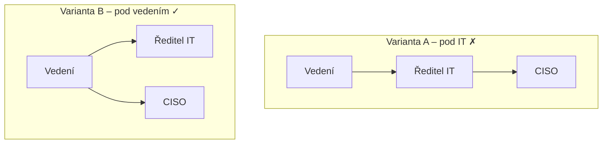

- **A – pod IT:** **konflikt zájmů** – CISO dohlíží na vlastního nadřízeného.
- **B – pod vedením:** **nezávislost** a přímý přístup k vedení.
- **Předpoklady úspěchu:** mandát a přímý přístup k vedení · zdroje (rozpočet, lidé) · **oddělení od správy systémů** · zastupitelnost · odbornost a průběžné vzdělávání.

### Kdo co dělá: matice RACI

*Slajd [[PV017_04_2026_Role_rizeni_kyberneticke_bezpecnosti.pdf#page=37|37]]* · detail: [[RACI]]

| Činnost | Vedení | Manažer KB | IT provoz | Garant aktiva | Auditor KB |
|---|---|---|---|---|---|
| Schválení bezpečnostní politiky | **A** | R | C | C | I |
| Analýza rizik | I | **A/R** | C | R | I |
| Akceptace zbytkového rizika | **A/R** | C | I | C | I |
| Zavedení technického opatření | I | **A** | R | C | I |
| Rozhodnutí o hlášení incidentu | I | **A/R** | C | C | I |
| Audit KB | **A** | C | C | C | R |

**R** provádí (Responsible) · **A** odpovídá a schvaluje (Accountable – **vždy jen jeden**) · **C** konzultován (Consulted) · **I** informován (Informed) · *ilustrativní příklad*.

### Vzdělávání a bezpečnostní kultura

*Slajd [[PV017_04_2026_Role_rizeni_kyberneticke_bezpecnosti.pdf#page=38|38]]*

| Cílová skupina | Forma |
|---|---|
| **Vedení** | prokazatelné školení o povinnostech a rizicích |
| **Všichni zaměstnanci** | vstupní a pravidelné školení, phishingové simulace |
| **Bezpečnostní role** | odborné vzdělávání, certifikace, cvičení |
| **Administrátoři a vývojáři** | bezpečná správa a bezpečný vývoj |

**Bezpečnostní kultura:** lidé hlásí chyby a podezřelé události **bez strachu z trestu**. *Pozdě nahlášený incident je dražší než přiznaná chyba.*

## 7. Shrnutí

### V praxi: od registrace k fungujícímu řízení

*Slajd [[PV017_04_2026_Role_rizeni_kyberneticke_bezpecnosti.pdf#page=40|40]]* – modelová situace: **regionální nemocnice**, regulovaná služba v režimu **vyšších povinností**.

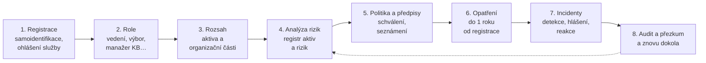

> [!important] Kroky 1–5 jsou **řídicí** – technická opatření přicházejí až v kroku 6.

### Pět hlavních myšlenek (slajd 41)

| Teze | Vysvětlení |
|---|---|
| **Řízení je převodník** | mezi regulací, která říká CO, a praxí, která řeší JAK |
| **Odpovědnost má vedení** | NIS2, DORA i ZoKB ji výslovně kladou na řídicí orgány |
| **Compliance je minimum** | řízení z ní dělá vedlejší produkt skutečné bezpečnosti |
| **Předpis platí, jen když žije** | schválení, prokazatelné seznámení, přezkum a vymáhání |
| **Role musí být jasné** | kdo provádí, kdo dohlíží, kdo nezávisle ověřuje |

### Otázky k zamyšlení ze slajdu 42 (s návrhem odpovědi)

> [!question]- Je možné být plně compliant a přesto nebezpečný? A naopak?
> **Ano.** Compliance kontroluje hlavně dokumentaci a minimální úroveň; útok míří na reálný systém („papírová bezpečnost", šetření na CHECK/ACT). Naopak organizace může být technicky dobře zabezpečená, ale non-compliant, pokud nedokáže **doložit** procesy, role a rozhodnutí (chybí evidence, seznámení, přezkum).

> [!question]- Kdo by měl v organizaci rozhodovat o akceptaci rizika – a proč ne IT?
> **Vedení** (vlastník rizika na úrovni byznysu), protože nese odpovědnost (NIS2 čl. 20, péče řádného hospodáře), zná apetit k riziku a disponuje zdroji. IT je v konfliktu zájmů (posuzovalo by vlastní práci a rozpočet) a nevidí byznysový dopad. Analýzu připravuje manažer KB s garanty aktiv.

> [!question]- Kam organizačně zařadit CISO a proč?
> Přímo **pod vedení** (varianta B), mimo IT – kvůli nezávislosti a přímému přístupu k rozhodovatelům; pod IT by dohlížel na vlastního nadřízeného. Nikdy ne do interního auditu (3. linie musí ověřovat i CISO).

> [!question]- Jak zajistit, aby bezpečnostní směrnice nebyla jen „šuplíkový" dokument?
> Schválení oprávněnou osobou, **prokazatelné seznámení** (podpis, e-learning), srozumitelnost a proveditelnost, vazba na rizika, měření plnění (metriky), přezkum min. 1× ročně + mimořádné spouštěče, a hlavně **vymáhání** (nevymáhaný předpis je horší než žádný).

> [!question]- Jak prosadit bezpečnostní požadavky vůči dodavateli, který je silnější smluvní stranou?
> Jen **smlouvou** (interní předpis dodavatele nezavazuje): bezpečnostní příloha, povinnost hlásit incidenty, právo auditu, sankce, exit strategie. Opora: zákonná povinnost promítnout požadavky do smluv (ZoKB) – argument „to po nás chce zákon"; požadovat certifikace (ISO 27001, EUCC); diverzifikace dodavatelů; kompenzační opatření na vlastní straně, když smlouvu nelze vyjednat.

---

## Otázky k procvičení

> [!question]- 1. Co znamená „regulace říká CO, řízení říká JAK"?
> Zákon stanoví cíle a povinnosti (často technologicky neutrálně); řízení KB je převádí na role, procesy, vnitřní předpisy a rozhodnutí o rizicích, ze kterých plynou konkrétní opatření. Výsledek: odolnost + doložitelnost.

> [!question]- 2. Popiš tři úrovně governance – management – operations a kdo na nich působí.
> Governance (vedení, výbor – směr, odpovědnost, dohled, apetit k riziku) · management (CISO, architekt – plánování, zavádění, měření, zlepšování) · operations (IT provoz, SOC, garanti aktiv, uživatelé – každodenní výkon, monitoring, reakce).

> [!question]- 3. Definuj compliance a uveď tři zdroje povinností.
> Schopnost organizace **prokazatelně** dodržovat povinnosti, které se na ni vztahují, **a doložit to**. Zdroje: právní (ZoKB, NIS2, DORA, CRA, GDPR), smluvní (zákazníci, pojištění, SLA), dobrovolně převzaté (ISO 27001, kodexy, vlastní politiky).

> [!question]- 4. (test) Které ustanovení NIS2 umožňuje dočasný zákaz výkonu řídicí funkce? a) čl. 20 · b) čl. 23 · c) čl. 32 odst. 5 · d) čl. 33
> **c) čl. 32 odst. 5** – u základních subjektů. (Čl. 20 = odpovědnost a školení vedení, čl. 23 = hlášení incidentů.)

> [!question]- 5. (test) Lhůty pro hlášení významného incidentu podle NIS2 čl. 23 jsou:
> **24 h** včasné varování → **72 h** oznámení incidentu → **1 měsíc** závěrečná zpráva. Souběžně GDPR čl. 33: 72 h na ÚOOÚ při porušení zabezpečení osobních údajů.

> [!question]- 6. Které vyhlášky provádějí nový ZoKB a čím se liší?
> **409/2025 Sb.** – režim **vyšších** povinností (systém řízení bezpečnosti, povinnosti vedení, výbor pro řízení KB, bezpečnostní role, politika a dokumentace…). **410/2025 Sb.** – režim **nižších** povinností (vedení určí osobu pověřenou KB, školení vedení, zdroje, politika a přezkum).

> [!question]- 7. Kde na PDCA se nejčastěji šetří a co z toho vzniká?
> Na **CHECK a ACT** → vzniká **papírová bezpečnost** (dokumenty bez ověření účinnosti a bez zlepšování).

> [!question]- 8. Jak se určuje rozsah řízení KB a co platí, dokud určen není?
> Identifikuj primární aktiva organizace → vyber ta související s regulovanou službou → přidej související organizační části a podpůrná aktiva. Dokud není rozsah určen, **platí pro celou organizaci**.

> [!question]- 9. Vyjmenuj čtyři strategie zvládání rizik a kdo rozhoduje o zbytkovém riziku.
> Snížit (opatření) · přenést (pojištění, smlouva) · vyhnout se (ukončit činnost) · akceptovat (vědomé rozhodnutí). O přijatelnosti zbytkových rizik **prokazatelně rozhoduje vedení**.

> [!question]- 10. Co musí mít každý proces řízení KB?
> Vlastníka · předpis · záznamy · metriku.

> [!question]- 11. (test) Za jakých podmínek je vnitřní předpis závazný pro zaměstnance (§ 305, § 301 ZP)?
> Písemný, bez zpětné účinnosti, v souladu se zákonem, zaměstnanci **seznámeni do 15 dnů** a předpis přístupný; zaměstnanec ho dodržuje, **pokud s ním byl řádně seznámen**. Uchovává se 10 let.

> [!question]- 12. Zavazuje vnitřní předpis dodavatele? Jak lze dodavatele zavázat?
> **Ne.** Pouze **smlouvou** (bezpečnostní příloha, hlášení incidentů, právo auditu, sankce, exit). Co není ve smlouvě, nelze vymáhat.

> [!question]- 13. Popiš model tří linií a zařaď CISO, SOC, interní audit, DPO a NÚKIB.
> 1. linie výkon (SOC, IT provoz, vlastníci procesů, garanti aktiv) · 2. linie expertíza a dohled (**CISO**, řízení rizik, compliance, **DPO**) · 3. linie nezávislá kontrola (**interní audit**, auditor KB). Nad nimi řídicí orgán; **NÚKIB** je externí kontrola (spolu s externím auditorem a certifikačním orgánem).

> [!question]- 14. (test) V matici RACI může mít jedna činnost: a) více R i více A · b) více R, ale jen jedno A · c) jen jedno R a jedno A · d) žádné A
> **b)** – Accountable je **vždy jen jeden**.

> [!question]- 15. Jaké role definuje vyhl. 409/2025 Sb. a jaké omezení platí pro auditora KB?
> Vrcholné vedení, výbor pro řízení KB, manažer KB, architekt KB, garant aktiva, auditor KB. Auditor **nesmí auditovat sám sebe** (nezávislost).

> [!question]- 16. Co znamená „implement once, comply many"?
> Jeden jednotný systém řízení KB se společnou sadou opatření pokrývá více regulací najednou (NIS2/DORA, GDPR, CRA, smlouvy, ISO) místo izolovaných compliance projektů.

## Souvislosti

- Předchozí: [[3 260929 - Přístup k regulaci KB|P3]] (proč a jak se reguluje) · [[2 260922 - ISMS a role v organizaci|P2]] (ISMS, CISO, řídicí výbor)
- Navazuje: P6 ISMS (20. 10.), P7 standardy a Common Criteria (27. 10.), P9 právní rámec
- Pojmy: [[Governance, management a provoz]] · [[Compliance]] · [[Odpovědnost vedení]] · [[ZoKB]] · [[PDCA]] · [[Rozsah řízení (scope)]] · [[Rámce řízení KB]] · [[Řízení rizik]] · [[Řízení dodavatelů]] · [[Hlášení incidentů]] · [[Vnitřní předpisy]] · [[Model tří linií]] · [[Bezpečnostní role]] · [[CISO]] · [[RACI]]
- [[PV017 - Glosář|Glosář]]
