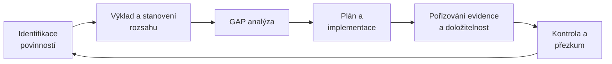

# Compliance

> [!summary] Definice
> **Compliance = schopnost organizace prokazatelně dodržovat povinnosti, které se na ni vztahují – a doložit to.**

## Zdroje povinností (P4, s. 8)

| Právní | Smluvní | Dobrovolně převzaté |
|---|---|---|
| ZoKB 264/2025 + vyhlášky · NIS2, DORA, CRA · GDPR čl. 32 · sektorová regulace | požadavky zákazníků a partnerů · podmínky kyberpojištění · SLA a bezpečnostní přílohy | ISO/IEC 27001 certifikace · kodexy a oborové standardy · vlastní politiky · veřejné závazky |

## Cyklus „od regulace ke compliance" (P4, s. 9)

Cyklus se opakuje – **mění se regulace, organizace i hrozby**.

## Compliance vs. bezpečnost

**Meze a přínosy** (P3, s. 35):

| Meze compliance | Přínos compliance |
|---|---|
| splněný audit **není důkazem odolnosti** | stanoví **minimální úroveň** |
| kontroluje se dokumentace, **útok míří na systém** | bez měřitelné povinnosti **není odpovědnost** |
| nejistota v přístupu, nutná škálovatelnost | doložený postup rozhoduje o **zavinění a náležité péči** |

**Bez řízení × skrze řízení** (P4, s. 13):

| Compliance bez řízení | Compliance skrze řízení |
|---|---|
| „**papírová bezpečnost**" pro kontrolu | dokumenty popisují skutečný stav |
| jednorázový projekt před auditem | kontinuální proces ([[PDCA]]) |
| opatření bez vazby na rizika | opatření z analýzy rizik |
| nikdo neví, zda fungují | účinnost se měří |
| rozmazaná odpovědnost | jasní vlastníci a role |

> [!important] Klíčové věty
> - „**Compliance je minimum, ne cíl.** Řízení z ní dělá vedlejší produkt dobré bezpečnosti."
> - „**Implement once, comply many**" – jeden systém řízení se společnou sadou opatření pokryje NIS2/DORA, GDPR, CRA, smlouvy i ISO.

## Souvislosti

- Přednášky: [[3 260929 - Přístup k regulaci KB|P3]] – [[PV017_03_2026_Pristup_k_regulaci_kyberneticke_bezpecnosti.pdf#page=35|s. 31, 35]] · [[4 261006 - Role řízení KB|P4]] – [[PV017_04_2026_Role_rizeni_kyberneticke_bezpecnosti.pdf#page=8|s. 8–13]]
- Související: [[ISMS]] · [[PDCA]] · [[Odpovědnost vedení]] · [[ZoKB]] · [[NIS2]] · [[Regulatorní mix]]
