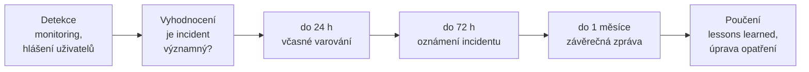

# Řízení a hlášení incidentů

> [!summary] Lhůty NIS2 čl. 23 (transponováno do ZoKB)
> **24 h** včasné varování → **72 h** oznámení incidentu → **1 měsíc** závěrečná zpráva.

## Co musí řízení určit předem

- **kdo vyhodnocuje** a **kdo rozhoduje o hlášení** (v RACI: manažer KB = A/R),
- **kontakty na NÚKIB / CSIRT** a **zastupitelnost**.

## Souběh povinností

| Předpis | Lhůta / komu |
|---|---|
| ZoKB / NIS2 čl. 23 | 24 h / 72 h / 1 měsíc → NÚKIB (CSIRT) |
| **GDPR čl. 33** | **72 h → ÚOOÚ** při porušení zabezpečení osobních údajů |
| DORA | vlastní režim pro finanční sektor |
| CRA | výrobci hlásí aktivně zneužívané zranitelnosti a závažné incidenty (od 11. 9. 2026) |
| smlouvy | hlášení dodavatelem odběrateli |

## Procesní kontext

- Incident response patří mezi procesy „**reakce a obnova**" spolu s logováním a monitoringem, kontinuitou a zálohováním (P4, s. 19).
- ISMS dokument č. 14: **procedura reakce na incidenty** (záznam, klasifikace, zvládání událostí, incidentů a zranitelností).
- CISO: přijímá hlášení, řídí reakci, připravuje **důkazy pro právní řízení**, analyzuje příčiny.
- **Bezpečnostní kultura:** „Pozdě nahlášený incident je dražší než přiznaná chyba." Lidé mají hlásit bez strachu z trestu.

> [!info] Kontext navíc
> Podle NIS2 čl. 23: včasné varování uvádí, zda je podezření na protiprávní / škodlivý čin nebo přeshraniční dopad; oznámení obsahuje prvotní posouzení závažnosti, dopadu a indikátory kompromitace (IoC); na žádost CSIRT může přijít i průběžná zpráva.

## Souvislosti

- Přednášky: [[4 261006 - Role řízení KB|P4]] – [[PV017_04_2026_Role_rizeni_kyberneticke_bezpecnosti.pdf#page=23|s. 23]] · [[2 260922 - ISMS a role v organizaci|P2]] – s. 19, 70 · [[3 260929 - Přístup k regulaci KB|P3]] – s. 24 (příklad „hlaste do 24 h")
- Související: [[Útok a bezpečnostní incident]] · [[NIS2]] · [[ZoKB]] · [[GDPR]] · [[NÚKIB]]
