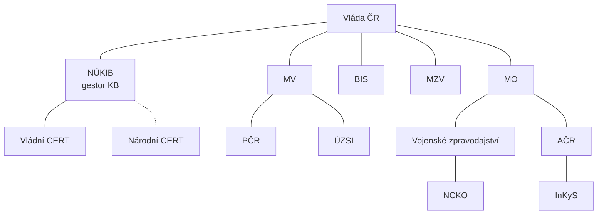

# Instituce kybernetické bezpečnosti v ČR

> [!summary] Myšlenka
> Kyber agendu v ČR sdílí více institucí podle oblastí: **bezpečnost strategické infrastruktury** (NÚKIB), **boj s kyberkriminalitou** (PČR), **zpravodajské služby** (BIS, ÚZSI, VZ), **kybernetická diplomacie** (MZV) a **kybernetická obrana** (MO, AČR).

## Mapa dle Národní strategie KB 2026–2030 (P3, s. 44)

| Oblast | Instituce |
|---|---|
| **Bezpečnost strategické infrastruktury** | **NÚKIB** (gestor KB), Vládní CERT, Národní CERT |
| **Boj s kyberkriminalitou** | **PČR** (vč. NCOZ – Národní centrála proti organizovanému zločinu) |
| **Zpravodajské služby** | **BIS**, **ÚZSI** (Úřad pro zahraniční styky a informace), **VZ** (Vojenské zpravodajství) |
| **Kybernetická diplomacie** | **MZV** |
| **Kybernetická obrana** | **MO**, **AČR**, **NCKO** (Národní centrum kybernetických operací, pod VZ), **InKyS** (Velitelství informačních a kybernetických sil), Vojenský CERT (CIRC) |

## Další (P3, s. 45)

**Výbor pro kybernetickou bezpečnost** (pracovní výbor Bezpečnostní rady státu) · NÚKIB a Vládní CERT · Národní CERT (csirt.cz) · NCOZ · ÚZSI · Vojenský CERT (CIRC) · Velitelství informačních a kybernetických sil · NCKO · BIS.

> [!tip] Spojení s rozdělením agendy
> Viz [[Kyberbezpečnost, kyberobrana, kyberkriminalita]] – každá oblast má své gestory.

## Souvislosti

- Přednáška: [[3 260929 - Přístup k regulaci KB|P3]] – [[PV017_03_2026_Pristup_k_regulaci_kyberneticke_bezpecnosti.pdf#page=44|s. 44–45]], s. 17
- Související: [[NÚKIB]] · [[Kyberbezpečnost, kyberobrana, kyberkriminalita]] · [[ZoKB]]
