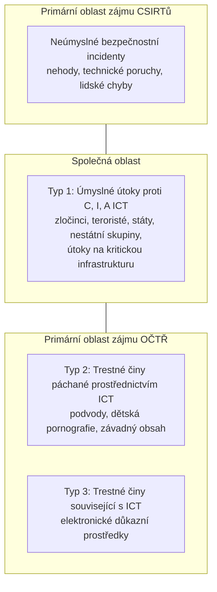

# Kyberbezpečnost × kyberobrana × kyberkriminalita

> [!summary] Myšlenka
> Stát dělí „kyber" agendu do tří oblastí s **různým cílem i různými gestory**.

| | Kybernetická **kriminalita** | Kybernetická **bezpečnost** | Kybernetická **obrana** |
|---|---|---|---|
| Chrání | před **trestnou činností** | **prostředí (infrastrukturu)** | **suverenitu státu** |
| Gesce | OČTŘ, státní zastupitelství, soudy (PČR, NCOZ) | **NÚKIB**, CERT/CSIRT týmy | armáda a bezpečnostní složky, **Vojenské zpravodajství** (MO, AČR, NCKO) |

- **Kybernetická obrana** = autonomní, specifická oblast širšího konceptu KB; obrana státu ve smyslu **zákona o zajišťování obrany ČR** (svrchovanost, územní celistvost, principy demokracie a právního státu, ochrana obyvatel a majetku před vnějším napadením; vč. účasti v kolektivní obraně).
- Úrovně: **individuální → organizace → stát → mezinárodní společenství**.

## Prolínání CySec / CyCrime (P3, s. 18)

> [!tip] Na zkoušku
> **Typ 1** (úmyslné útoky proti C/I/A) je **společná oblast** CSIRTů i OČTŘ; neúmyslné incidenty řeší primárně CSIRT; typ 2 a 3 jsou primárně trestněprávní.

## Souvislosti

- Přednáška: [[3 260929 - Přístup k regulaci KB|P3]] – [[PV017_03_2026_Pristup_k_regulaci_kyberneticke_bezpecnosti.pdf#page=15|s. 15–19]]
- Související: [[Kybernetická bezpečnost (pojem)]] · [[Instituce KB v ČR]] · [[NÚKIB]]
