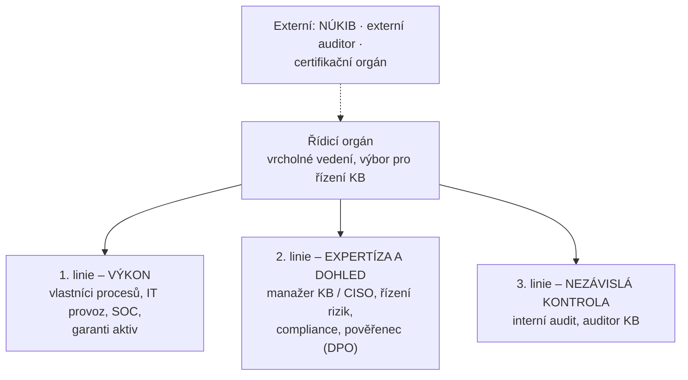

# Model tří linií (IIA, 2020)

> [!summary] Definice
> Model rozdělení rolí v řízení (rizik, bezpečnosti) podle **The IIA's Three Lines Model (2020)**: **1. linie výkon**, **2. linie expertíza a dohled**, **3. linie nezávislá kontrola**, nad nimi **řídicí orgán**; vně **externí** kontrola.

| Linie | Úloha | Kdo |
|---|---|---|
| Řídicí orgán | odpovědnost, směr, apetit k riziku | vrcholné vedení, výbor pro řízení KB |
| **1.** | **výkon** – vlastní a řídí rizika v každodenní práci | vlastníci procesů, IT provoz, SOC, garanti aktiv |
| **2.** | **expertíza a dohled** – metodika, podpora, monitoring 1. linie | CISO / manažer KB, řízení rizik, compliance, DPO |
| **3.** | **nezávislá kontrola** – ověřuje 1. i 2. linii | interní audit, auditor KB |
| Externí | kontrola zvenku | NÚKIB, externí auditor, certifikační orgán |

> [!tip] Typické chytáky
> - CISO **není** 3. linie – proto nesmí sedět v interním auditu (konflikt zájmů).
> - Auditor KB **nesmí auditovat sám sebe**.
> - Model z roku 2020 nahradil starší „Three Lines of Defense" (důraz na spolupráci místo „obrany").

## Souvislosti

- Přednáška: [[4 261006 - Role řízení KB|P4]] – [[PV017_04_2026_Role_rizeni_kyberneticke_bezpecnosti.pdf#page=33|s. 33]]
- Související: [[Bezpečnostní role]] · [[CISO]] · [[Governance, management a provoz]] · [[RACI]]
