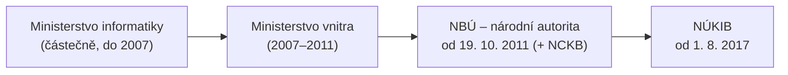

# NÚKIB – Národní úřad pro kybernetickou a informační bezpečnost

> [!summary] Definice
> Ústřední správní orgán ČR pro kybernetickou bezpečnost – **gestor kybernetické bezpečnosti** (bezpečnost strategické infrastruktury). Vznikl **1. 8. 2017** z NBÚ a jeho Národního centra kybernetické bezpečnosti (NCKB). Provozuje **Vládní CERT**.

## Vývoj (P3, s. 42–43)

- Před 2011 KB řešena **individuálně, bez koordinace státem**.
- **19. 10. 2011** – vláda ustanovila **NBÚ** národní autoritou; úkol vybudovat NCKB, ZoKB, Radu pro KB, specializovanou instituci.

## Co NÚKIB dělá (v kontextu kurzu)

- gestor KB, dozor nad povinnými subjekty dle [[ZoKB]] (registrace, **kontroly**, sankce),
- příjem **hlášení incidentů**, **varování** a **protiopatření** (povinné subjekty je musí zavádět),
- **Vládní CERT**; Národní CERT (CSIRT.CZ) je s NÚKIB propojen,
- **Národní strategie KB 2026–2030**,
- metodiky a výklad (např. průvodce novým ZoKB),
- spolu s BIS, VZ a ÚZSI provedl **první veřejnou atribuci** (APT31 vs. MZV, 28. 5. 2025).

> [!example] Statistika
> **NÚKIB za rok 2025: 203 incidentů, z toho 2 velmi významné** – meziročně o 65 méně, ale sofistikovanost útoků roste.

## Souvislosti

- Přednášky: [[3 260929 - Přístup k regulaci KB|P3]] – [[PV017_03_2026_Pristup_k_regulaci_kyberneticke_bezpecnosti.pdf#page=42|s. 42–45]], s. 6 · [[4 261006 - Role řízení KB|P4]] – s. 10, 22, 23, 33
- Související: [[Instituce KB v ČR]] · [[ZoKB]] · [[Hlášení incidentů]] · [[Model tří linií]]
