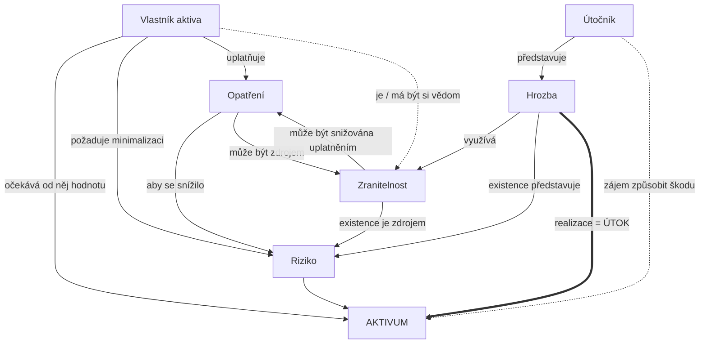

# Obecný model zabezpečování

> [!summary] Myšlenka
> Diagram vztahů mezi **vlastníkem aktiva, útočníkem, aktivem, hrozbou, zranitelností, rizikem a opatřením**. Vlastník chce od aktiva hodnotu a minimalizovat riziko; útočník má protichůdný zájem způsobit škodu.

## Jak model číst

1. **Vlastník** aktiva od něj očekává hodnotu, požaduje minimalizaci rizika a proto **uplatňuje opatření**; o zranitelnostech by měl vědět.
2. **Útočník** představuje **hrozbu**, která **využívá zranitelnost**; realizace hrozby = **útok** na aktivum.
3. **Riziko** vzniká z existence hrozby a z existence zranitelnosti (průnik obou – na slajdu červená elipsa).
4. **Opatření** snižuje riziko a zranitelnost – ale **samo může být zdrojem nové zranitelnosti** (např. špatně nastavený bezpečnostní SW).

## Tři řídicí vrstvy (legenda slajdu 30)

| Co | Zajišťuje |
|---|---|
| účinná opatření | procesy **[[Řízení rizik|řízení rizik]]** |
| validní uplatňování opatření | **bezpečnostní politika** ([[Vnitřní předpisy]]) |
| aktuálnost opatření a politiky | procesy **[[ISMS]]** |

> [!info] Kontext
> Model vychází z obdobného diagramu v ISO/IEC 15408 (Common Criteria), kde *owners* chrání *assets* před *threat agents* pomocí *countermeasures*.

## Souvislosti

- Přednáška: [[1 260915 - Úvod do informační bezpečnosti|P1]] – [[PV017_01_2026_uvod_do_bezpecnosti.pdf#page=26|s. 26–30]]
- Související: [[Aktivum]] · [[Hrozba]] · [[Zranitelnost]] · [[Riziko]] · [[Opatření]] · [[Model útočníka]]
