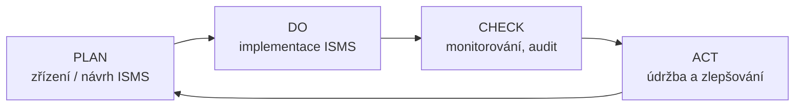

# PDCA – Plan-Do-Check-Act

> [!summary] Definice
> **Demingův cyklus** – metoda **postupného (neustálého) zlepšování** kvality výrobků, služeb, procesů… opakovaným prováděním čtyř činností: **plánuj → udělej → zkontroluj → jednej**. Široce používán v řízení kvality, a proto i pro [[ISMS]].

| Fáze | ISO 27001 (2005 terminologie) | Kap. 27001:2022 | Hlavní činnosti |
|---|---|---|---|
| **PLAN** | Establish | 4–6 | kontext, scope, politika, metodika a analýza rizik, výběr opatření, **SoA** |
| **DO** | Implement & Operate | 7–8 | **plán zvládání rizik**, implementace opatření, detekce incidentů, školení, zdroje |
| **CHECK** | Monitor & Review | 9 | monitoring, měření účinnosti, testování, **interní audit**, zprávy pro vedení, **přezkoumání vedením** |
| **ACT** | Maintain & Improve | 10 | **nápravná opatření**, implementace vylepšení |

## Klíčové body

- ISO 27001 **původně direktivně předepisoval** PDCA pro implementaci ISMS; dnes ho nevyžaduje explicitně, ale struktura kapitol 4–10 mu odpovídá.
- Další aplikovatelné metody řízení: **COBIT**, **ITIL**.
- Cyklus se točí stále dokola – každá otočka posouvá úroveň (kvalita roste „po svahu", standardy fungují jako zarážky – obrázek P2, s. 43).

> [!warning] Papírová bezpečnost
> Nejčastěji se šetří na **CHECK a ACT** – a právě tam vzniká **papírová bezpečnost** ([[4 261006 - Role řízení KB|P4]], s. 15).

## Souvislosti

- Přednášky: [[1 260915 - Úvod do informační bezpečnosti|P1]] – [[PV017_01_2026_uvod_do_bezpecnosti.pdf#page=12|s. 12–13]] · [[2 260922 - ISMS a role v organizaci|P2]] – [[PV017_02_2026_ISMS.pdf#page=42|s. 42–47]] · [[4 261006 - Role řízení KB|P4]] – [[PV017_04_2026_Role_rizeni_kyberneticke_bezpecnosti.pdf#page=15|s. 15]]
- Související: [[ISMS]] · [[ISO-IEC 27001]] · [[Compliance]]
