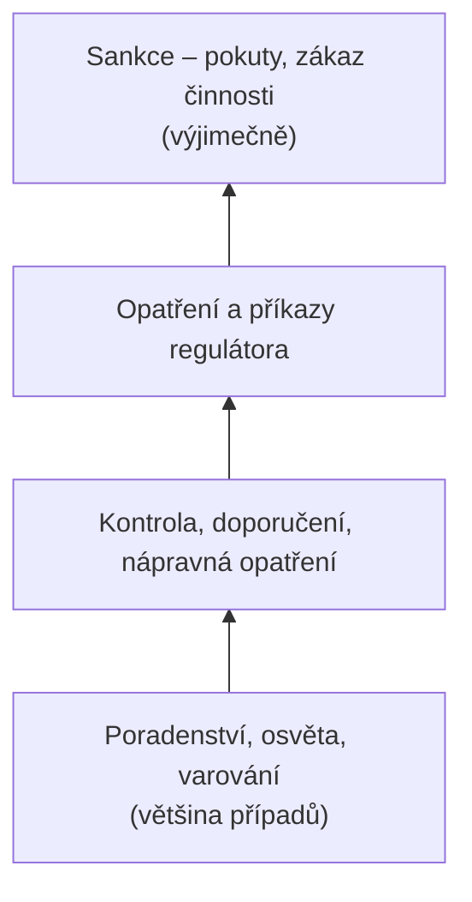

# Regulatorní mix a regulatorní pyramida

> [!summary] Myšlenka
> Regulátor nemá jen „zákaz + pokutu". **Chytrá regulace nevolí jeden nástroj, nýbrž jejich pořadí.**

## Nástroje (P3, s. 33)

| Nástroj | Příklad |
|---|---|
| **Command and control** | povinnost, kontrola, sankce (ZoKB, NIS2) |
| **Ko-regulace a samoregulace** | normy a **certifikace** (ISO 27001, EUCC) |
| **Ekonomické nástroje** | **pojištění**, veřejné zakázky (požadavky v zadání) |
| **Podpůrné nástroje** | **hlášení, varování, CSIRT** |

## Regulatorní pyramida

Od **poradenství** přes **nápravu** k **sankci** – regulátor eskaluje jen tehdy, když mírnější nástroj nezabral.

> [!info] Kontext navíc
> Koncept *responsive regulation* a regulatorní pyramidy pochází od Ayrese a Braithwaitea (1992). Typy pravidel: **deskriptivní / preskriptivní · performativní · chytrá** (P3, s. 31).

## Souvislosti

- Přednáška: [[3 260929 - Přístup k regulaci KB|P3]] – [[PV017_03_2026_Pristup_k_regulaci_kyberneticke_bezpecnosti.pdf#page=31|s. 31–33]]
- Související: [[Lessigovy modality regulace]] · [[Technologická neutralita]] · [[Rizikově orientovaný přístup]] · [[Compliance]]
