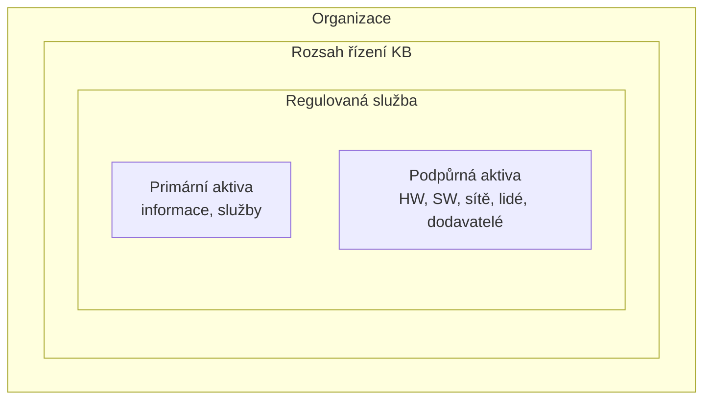

# Rozsah řízení (scope) / oblast působnosti ISMS

> [!summary] Definice
> Vymezená oblast (část organizace, služby, aktiva, lokace), **uvnitř které se uplatňuje řízení bezpečnosti**. Požadavek přímo daný standardem (27001 kap. 4) i zákonem ([[ZoKB]] – „stanovit rozsah řízení KB").

## Pravidla (P2, s. 12)

- oblastí **nemusí být celá organizace** (obvykle ji vymezí politika IB),
- informace do oblasti vstupuje a opouští ji **kontrolovaně** (určenými nástroji),
- v oblasti musí být **úplná chráněná informace** vč. všech technických i netechnických procesů,
- hranice **fyzicky nebo logicky** definovatelné (data, sítě, geografické lokace…),
- oblast musí být **vyčlenitelná od třetích stran** a jiných organizací ve skupině,
- dokument „Oblast působnosti ISMS" – krátký, hned na začátku.

## Postup dle P4 (s. 16)

1. Identifikuj **primární aktiva** celé organizace.
2. Urči ta, která souvisejí s **regulovanou službou**.
3. Urči související **organizační části a podpůrná aktiva**.
4. Tím je dán rozsah – **dokud není určen, platí pro celou organizaci**.

## Kontext organizace (P2, s. 13)

- *externí:* právní důsledky (přenosy dat US ↔ EU), geolokace (záplavy, hurikány, demonstrace), kulturní a sociální požadavky,
- *interní:* centralizace služeb (MUNI eduroam: CESNET → ÚVT → fakulty, FI výjimkou), vzdálené lokality (Telč).

> [!example] MediCloud
> Cloud a datacentrum jsou **mimo organizaci**, ale **uvnitř řízených závislostí ISMS** (řízeno smlouvami, SLA, audity).

## Souvislosti

- Přednášky: [[2 260922 - ISMS a role v organizaci|P2]] – [[PV017_02_2026_ISMS.pdf#page=12|s. 12–13]], [[PV017_02_2026_ISMS.pdf#page=26|s. 26]] · [[4 261006 - Role řízení KB|P4]] – [[PV017_04_2026_Role_rizeni_kyberneticke_bezpecnosti.pdf#page=16|s. 16]]
- Související: [[ISMS]] · [[Aktivum]] · [[Řízení dodavatelů]] · [[ZoKB]]
