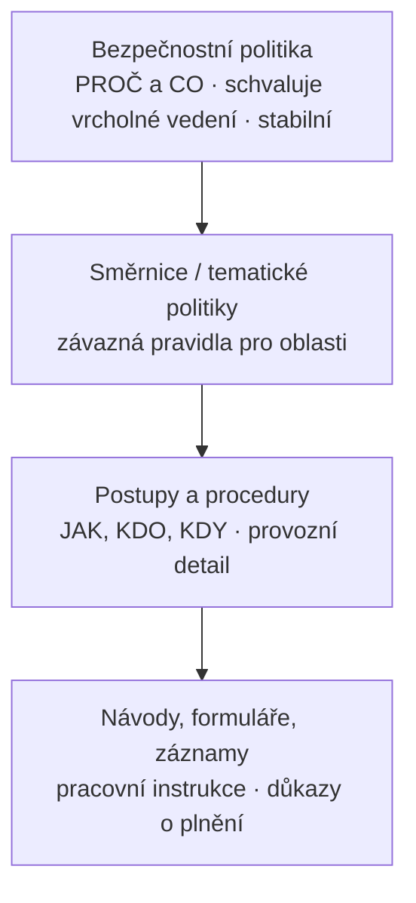
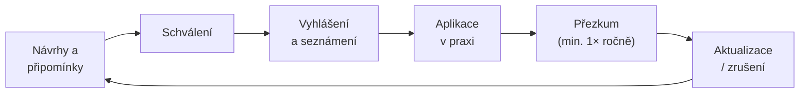

# Vnitřní předpisy (bezpečnostní politika, směrnice, postupy)

> [!summary] Myšlenka
> Vnitřní předpis převádí obecné povinnosti (zákon, normy, smlouvy) na **konkrétní chování** – kdo, co, kdy a jak dělá. Platí jen, **když žije**: je schválený, prokazatelně seznámený, aktuální a vymáhaný.

## K čemu slouží (P4, s. 25)

1. **konkretizuje** obecné povinnosti na pravidla,
2. **přiděluje** odpovědnosti a pravomoci,
3. **zavazuje** zaměstnance k dodržování,
4. **dokládá** náležitou péči vůči regulátorovi i soudu.

P1: „Validní uplatňování opatření předepisuje **bezpečnostní politika**." Politika je „specifikátor toho, co a jak dělat".

## Hierarchie

Čím níže, tím **detailnější, častěji měněné a schvalované na nižší úrovni**.

## Závaznost

| Vůči komu | Základ | Vynucení |
|---|---|---|
| **Zaměstnanci** | **§ 305 ZP** (vnitřní předpis) + **§ 301 ZP** (povinnost dodržovat předpisy, *pokud byl řádně seznámen*) | výtka · výpověď **§ 52 písm. g)** · okamžité zrušení **§ 55** · náhrada škody |
| **Vedení a statutáři** | péče řádného hospodáře, NIS2 čl. 20 | odpovědnost vůči společnosti, sankce regulátora |
| **Dodavatelé** | **nezavazuje – jen přes smlouvu** | smluvní pokuty, odstoupení, náhrada škody |
| **Externisté a uživatelé** | smlouva, NDA, podmínky užívání | smluvní sankce, odebrání přístupu |

**§ 305 ZP – náležitosti vnitřního předpisu:** písemně · **bez zpětné účinnosti** · nesmí odporovat zákonu · **seznámení do 15 dnů** · musí být přístupný · uchovává se **10 let**.

> [!important] Prokazatelné seznámení
> Podpis, potvrzení v e-learningu, evidence verzí. **Vyhláška 409/2025 Sb. vyžaduje strukturované potvrzení** seznámení.

## Aby předpis skutečně platil (checklist)

- [ ] schválen oprávněnou osobou (politiku schvaluje vedení)
- [ ] prokazatelně seznámeni všichni dotčení
- [ ] srozumitelný a proveditelný
- [ ] v souladu se zákonem (monitoring zaměstnanců – **§ 316 ZP**, GDPR)
- [ ] aktuální – přezkum **min. 1× ročně**, verzování
- [ ] kontrolován a vymáhán

> [!warning] **Nevymáhaný předpis je horší než žádný** – dává signál, že pravidla neplatí, a oslabuje pozici organizace při sporu i kontrole.

## Životní cyklus

**Spouštěče mimořádného přezkumu:** nová či změněná regulace · závažný incident · výsledek auditu či kontroly · reorganizace, nový systém či dodavatel · změna hrozeb (varování NÚKIB).

## Souvislosti

- Přednášky: [[4 261006 - Role řízení KB|P4]] – [[PV017_04_2026_Role_rizeni_kyberneticke_bezpecnosti.pdf#page=25|s. 25–31]] · [[1 260915 - Úvod do informační bezpečnosti|P1]] – s. 30, 32 · [[2 260922 - ISMS a role v organizaci|P2]] – dokumentace
- Související: [[Dokumentace ISMS]] · [[Compliance]] · [[Řízení dodavatelů]] · [[Odpovědnost vedení]]
