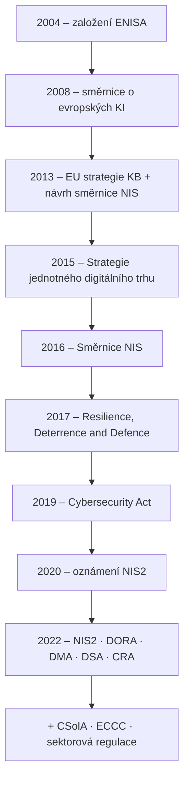

# Vývoj regulace kybernetické bezpečnosti v EU

| Rok | Krok | Pointa |
|---|---|---|
| 2004 | **ENISA** | spolupráce orgánů, pomoc se zvládáním incidentů, vzdělávání |
| 2008 | **Směrnice o evropských KI** | určování a označování evropské kritické infrastruktury (rozdílné definice), sektory a služby esenciální pro stát → vyčlenění KII; „poprvé se začalo mluvit o tom, že se s těmi internety bude muset něco udělat" |
| 2013 | **EU strategie KB**, návrh NIS | přesvědčit státy trvalo téměř 3 roky |
| 2015 | **Strategie jednotného digitálního trhu** | |
| 2016 | **Směrnice NIS** | 3 pilíře; 21 měsíců na implementaci → [[NIS2]] |
| 2017 | **Resilience, Deterrence and Defence: Building strong cybersecurity for the EU** | jednotný digitální trh bez CySec nevznikne; plán koordinované reakce na rozsáhlé přeshraniční incidenty; návrh Cybersecurity Act |
| 2019 | **Cybersecurity Act** | |
| 2022 | **NIS2, DORA, DMA, DSA, Cyber Resilience Act** | |
| + | **CSolA, ECCC**, sektorová regulace | |

## Role EU vs. ČR (P3, s. 22)

- pravomoci EU: **výlučné**, **sdílené** (jednotný trh, ochrana spotřebitele, spravedlnost a základní práva), **podpůrné** (civilní ochrana),
- EU i ČR: **harmonizace, regulace, podpůrné nástroje**,
- právo EU má na regulaci KB v ČR **stále větší vliv** (adopce, harmonizace).

> [!info] Kontext navíc – co je co
> - **Cybersecurity Act** – nařízení (EU) 2019/881: trvalý mandát **ENISA** + evropský rámec **kyberbezpečnostní certifikace** (např. schéma **EUCC** pro ICT produkty dle Common Criteria).
> - **DORA** – digitální provozní odolnost finančního sektoru → [[DORA]].
> - **DMA / DSA** – Digital Markets Act (gatekeepeři) / Digital Services Act (online platformy a obsah).
> - **CRA** – kyberbezpečnost produktů s digitálními prvky → [[CRA]].
> - **CSolA** – Cyber Solidarity Act (2025): evropský štít kybernetické bezpečnosti, mechanismus pro kybernetické mimořádné události.
> - **ECCC** – European Cybersecurity Competence Centre (Bukurešť), financování výzkumu a kapacit.
> - Celkový kontext datové legislativy (P3, s. 26): KB je jen jeden sloupec vedle dat a soukromí (GDPR, Data Act), AI, platforem, financí…

## Souvislosti

- Přednáška: [[3 260929 - Přístup k regulaci KB|P3]] – [[PV017_03_2026_Pristup_k_regulaci_kyberneticke_bezpecnosti.pdf#page=37|s. 37–41]], s. 22, 26
- Související: [[NIS2]] · [[DORA]] · [[CRA]] · [[GDPR]] · [[Přístupy k zajištění KB]]
