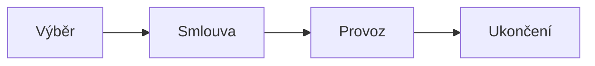

# Řízení dodavatelů (supplier management)

> [!summary] Myšlenka
> Dodavatelé jsou součástí **řízených závislostí** ISMS. Bezpečnostní požadavky na ně lze uplatnit **jen smlouvou** – vnitřní předpis odběratele dodavatele **nezavazuje**.

## Životní cyklus (P4, s. 21)

| Fáze | Co řešit |
|---|---|
| **Výběr** | bezpečnostní požadavky v zadání · hodnocení rizika dodavatele · certifikace (ISO 27001, **EUCC**) |
| **Smlouva** | bezpečnostní příloha · **hlášení incidentů dodavatelem** · **právo auditu**, sankce |
| **Provoz** | monitoring plnění a SLA · řízení přístupů dodavatele · pravidelné přehodnocení |
| **Ukončení** | **exit strategie** · vrácení a výmaz dat · odebrání přístupů |

> [!warning] „Vnitřní předpis dodavatele nezavazuje. **Co není ve smlouvě, nelze vymáhat.**"

## Další body

- ZoKB: povinnost **promítnout bezpečnostní požadavky do smluv s dodavateli**.
- MediCloud (P2): pro riziko „špatný provider" – **due diligence**, SLA, audit rights, subdodavatelé, exit plán, reporting; role *supplier manager*.
- Dokument ISMS č. 13 „Bezpečnostní politika pro dodavatele" (lustrace, hodnocení rizik, smluvní opatření, dozor, ukončení přístupů).
- Vynucení: smluvní pokuty, odstoupení, náhrada škody, odebrání přístupu.
- Supply chain útoky (SolarWinds 2020) ukazují, proč je to klíčové.

## Souvislosti

- Přednášky: [[4 261006 - Role řízení KB|P4]] – [[PV017_04_2026_Role_rizeni_kyberneticke_bezpecnosti.pdf#page=21|s. 21]], s. 29 · [[2 260922 - ISMS a role v organizaci|P2]] – s. 19, 29–30 · P12 (dodavatelské řetězce)
- Související: [[Vnitřní předpisy]] · [[Rozsah řízení (scope)]] · [[ZoKB]] · [[CRA]]
