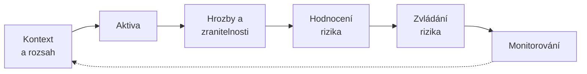

# Řízení rizik (risk management)

> [!summary] Definice
> Proces **identifikace, hodnocení a zvládání (ošetření) rizik** a jejich průběžného monitorování. Je **motorem řízení KB** – z něj se odvozují opatření, rozpočet i priority.

## Proces (P4, s. 20)

## Strategie zvládání rizik

| Strategie | Jak | Příklad |
|---|---|---|
| **Snížit** (modify / mitigate) | zavést opatření | MFA, šifrování, zálohy |
| **Přenést** (share / transfer) | pojištění, smlouva | kyberpojištění, outsourcing s SLA |
| **Vyhnout se** (avoid) | ukončit rizikovou činnost | zrušit nepotřebnou službu |
| **Akceptovat** (retain / accept) | **vědomé rozhodnutí vedení** | nízké riziko, kde opatření stojí víc než škoda |

P2 (metodika rizik) uvádí i variantu **„zvýšení úrovně akceptovatelnosti"** – tj. změnu kritérií rozhodnutím vedení.

## Kdo co dělá

- **Analýzu připravuje manažer KB s garanty aktiv.**
- **O přijatelnosti zbytkových rizik prokazatelně rozhoduje vedení** (akceptace není nečinnost, je to formální rozhodnutí oprávněné role).
- CISO učí zaměstnance hodnotit rizika, koordinuje hodnocení, navrhuje opatření a termíny ([[CISO]]).

## Výstupy

**Registr aktiv** · **registr rizik** · **[[Plán zvládání rizik (RTP)|plán zvládání rizik]]** · **[[Prohlášení o aplikovatelnosti (SoA)|prohlášení o aplikovatelnosti]]** (+ zpráva o posouzení a ošetření rizik, metodika řízení rizik).

## Zásady

- zavedení IB vychází z výstupů řízení rizik – **jak silné a nákladné zabezpečení dává smysl** (P2, s. 50),
- založeno na **ochotě organizace riskovat** (akceptovatelné ztráty),
- **metodika** (škály, kritéria akceptace) se píše **před** samotným hodnocením rizik,
- norma: **ISO/IEC 27005**.

> [!example] MediCloud – kvantifikace
> R = P × D (1–4); **1–3 akceptovat · 4–7 posoudit · 8–16 řešit** → viz [[Riziko]].

## Souvislosti

- Přednášky: [[1 260915 - Úvod do informační bezpečnosti|P1]] – s. 53, 59 · [[2 260922 - ISMS a role v organizaci|P2]] – [[PV017_02_2026_ISMS.pdf#page=16|s. 16–17]], [[PV017_02_2026_ISMS.pdf#page=28|s. 28–30]] · [[3 260929 - Přístup k regulaci KB|P3]] – s. 12–13 · [[4 261006 - Role řízení KB|P4]] – [[PV017_04_2026_Role_rizeni_kyberneticke_bezpecnosti.pdf#page=20|s. 20]]
- Související: [[Riziko]] · [[Opatření]] · [[ISMS]] · [[Rizikově orientovaný přístup]]
