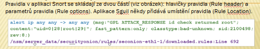

# Zdroje Varování

Snort - Popularni ID/PS

modra = hlavicka

zelena = parametry (options)

fialova = umistneni na serveru

Parametry pravidel - Obsahuje metadata a textovou zpravu ktera se vztahuje k varovani

GPL - Starsi, Open Source

ET - Security Onion, ig taky open source a nahrazuje GPL?

VRT - ciscociscociscociscociscociscocisco

# Vyhodnocování

False positive, true negative, yadayada ty uz vis co to je ale kdyby ne

chceme co nejvic truepos a trueneg, nejmin falsepos (ty jsou ale celkem ok) a falseneg

## Deterministická a pravděpodobnostní analýza

Deter - Vyhodnocuje podle toho co o zranitelnosti víme 

Prav - Pravděpodobnost zneužití na základě úspěšnosti dalšího kroku (idk nechápu, on to taky nijak nepopsal)

Basically Deter je pokud 100% víme postup, Prav je odhadování úspěšnosti různých kroků